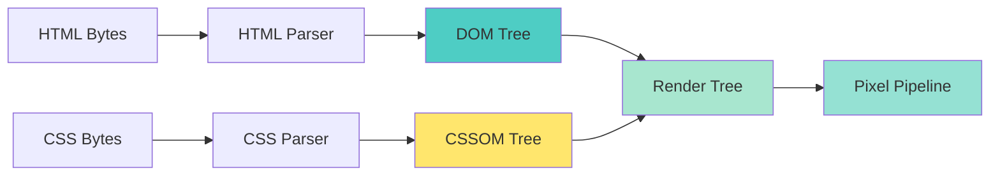
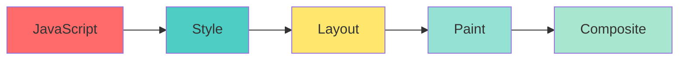
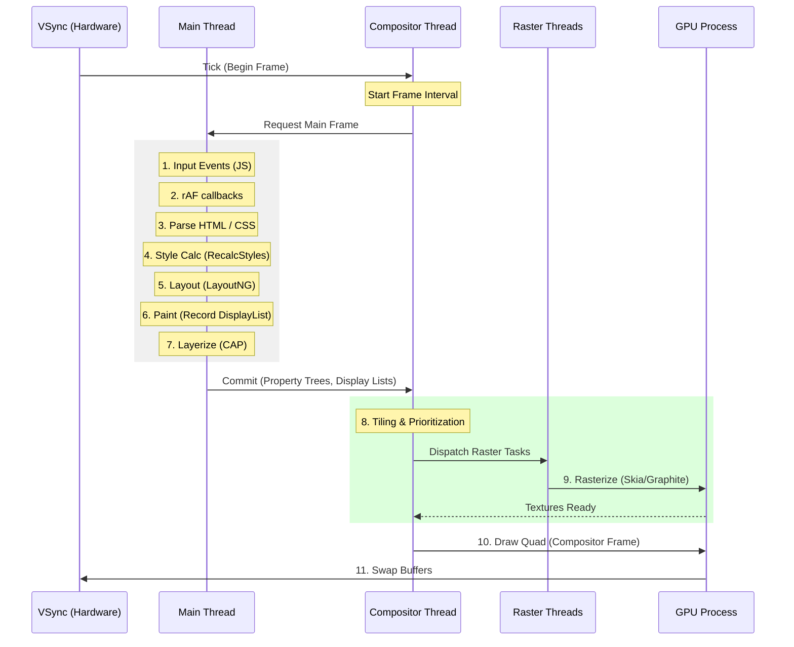
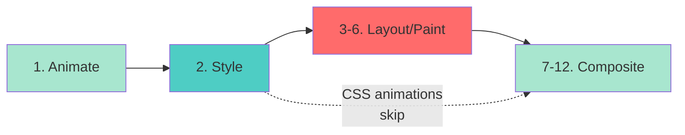
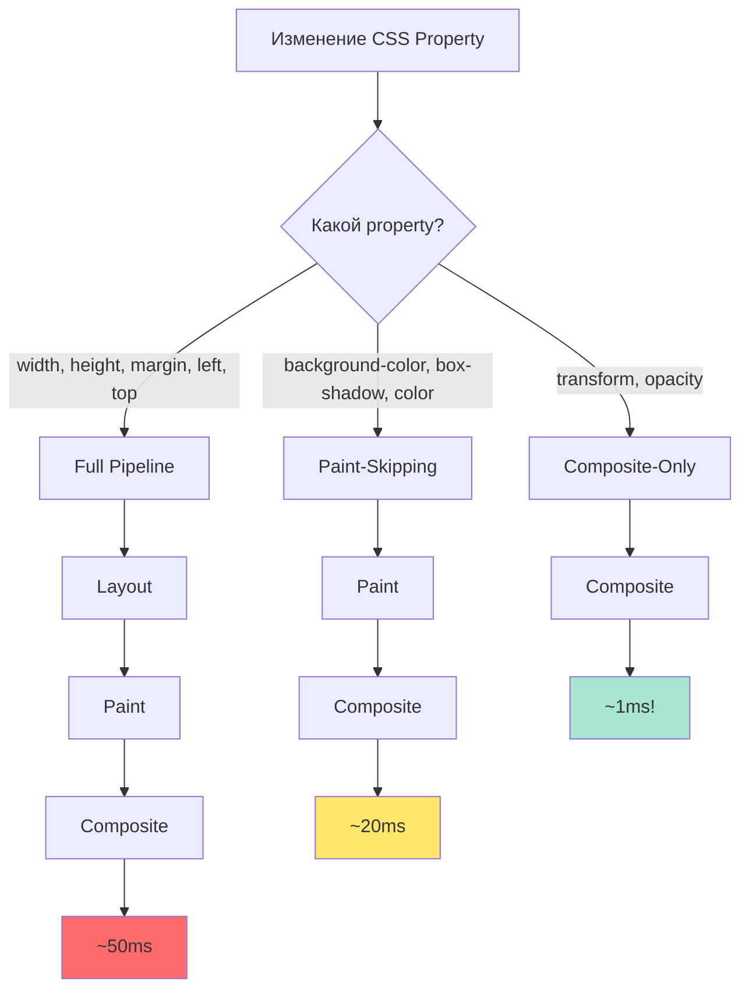
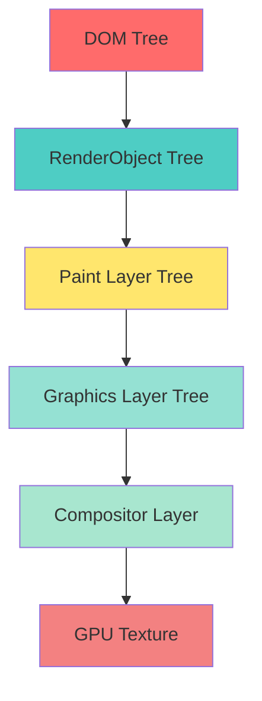
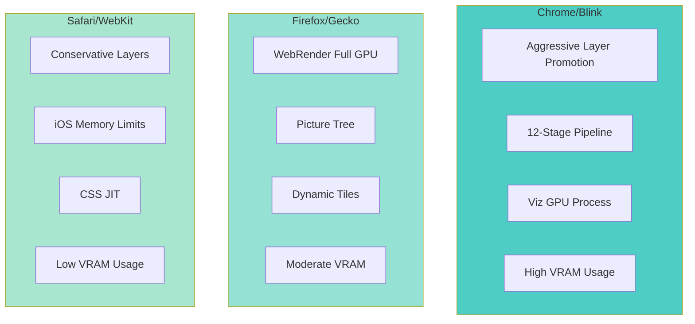
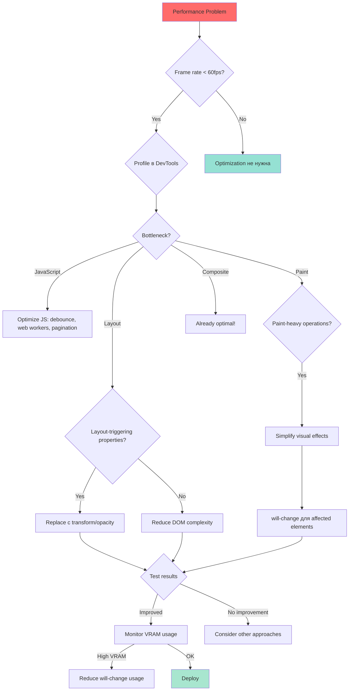

# Внутренности браузерного рендеринга: от jank к butter-smooth анимациям

**Дата:** 2025-12-06
**Автор:** Frontend Performance Enthusiast
**Время чтения:** ~30 минут

---

## Оглавление

- [Пролог: когда всё идёт не так](#пролог-когда-всё-идёт-не-так)
- [Часть 1: Pixel Pipeline — путь от JavaScript до GPU](#часть-1-pixel-pipeline--путь-от-javascript-до-gpu)
  - [Проблема: Layout Thrashing](#проблема-layout-thrashing)
  - [Решение: Compositor-Only Properties](#решение-compositor-only-properties)
  - [Frame Budget: 16.66ms на всё](#frame-budget-1666ms-на-всё)
  - [Пять стадий Pixel Pipeline](#пять-стадий-pixel-pipeline)
  - [Три Performance Pathways](#три-performance-pathways)
  - [Main Thread vs Compositor Thread](#main-thread-vs-compositor-thread)
- [Часть 2: `will-change` — двуликий Янус оптимизации](#часть-2-will-change--двуликий-янус-оптимизации)
  - [Что такое `will-change`?](#что-такое-will-change)
  - [Как работает layer promotion](#как-работает-layer-promotion)
  - [Memory implications: VRAM calculations](#memory-implications-vram-calculations)
  - [Implicit compositing: скрытая угроза](#implicit-compositing-скрытая-угроза)
  - [Best practices](#best-practices)
  - [Legacy hacks: translateZ(0) и компания](#legacy-hacks-translatez0-и-компания)
- [Часть 3: Три движка — три реальности](#часть-3-три-движка--три-реальности)
  - [Blink (Chrome, Edge, Brave, Opera)](#blink-chrome-edge-brave-opera)
  - [Gecko (Firefox)](#gecko-firefox)
  - [WebKit (Safari, iOS)](#webkit-safari-ios)
  - [Сравнительная таблица](#сравнительная-таблица)
- [Часть 4: Практические инструменты debugging](#часть-4-практические-инструменты-debugging)
  - [Chrome DevTools](#chrome-devtools)
  - [Firefox Developer Tools](#firefox-developer-tools)
  - [Safari Web Inspector](#safari-web-inspector)
  - [Debugging workflow](#debugging-workflow)
- [Часть 5: Оптимизационное дерево решений](#часть-5-оптимизационное-дерево-решений)
  - [Объяснение дерева решений](#объяснение-дерева-решений)
  - [Реальный пример оптимизации](#реальный-пример-оптимизации)
- [Эпилог: Будущее rendering оптимизации](#эпилог-будущее-rendering-оптимизации)
  - [CSS Containment (`contain`)](#css-containment-contain)
  - [`content-visibility`](#content-visibility)
  - [CSS Houdini APIs](#css-houdini-apis)
  - [Будущие разработки браузеров](#будущие-разработки-браузеров)
  - [Заключительные мысли](#заключительные-мысли)
- [Ресурсы для дальнейшего изучения](#ресурсы-для-дальнейшего-изучения)

---

## Пролог: когда всё идёт не так

Представьте ситуацию: вы работаете над новым feature для e-commerce сайта — карусель продуктов с плавными transitions между слайдами. Код выглядит чисто, CSS transitions настроены, анимация на вашем MacBook Pro работает идеально. Вы отправляете feature в production, и через неделю приходит feedback: «На моём старом laptop карусель жутко лагает, а на iPhone battery садится за пару часов».

Знакомая история? Я сталкивался с этим десятки раз. И каждый раз первопричина была одинаковой — **непонимание того, как браузер на самом деле рисует пиксели на экране**.

Frontend performance — это не магия и не случайность. Это **системное понимание browser internals**: как движок преобразует ваш HTML, CSS и JavaScript в pixels на дисплее, какие операции дорогие, какие — дешёвые, и где именно находятся bottlenecks.

В этой статье мы погрузимся глубоко — от high-level pixel pipeline до низкоуровневых деталей compositor threads, GPU textures и VRAM management. Мы разберём CSS property `will-change`, которое может как спасти производительность, так и убить её. Мы поймём разницу между rendering в Chrome (Blink), Firefox (Gecko) и Safari (WebKit), и научимся использовать DevTools для systematic debugging.

**Дисклеймер:** Никаких analogies — только threads, bitmaps, textures, draw calls и GPU operations. Только точная техническая информация для тех, кто хочет master frontend performance.

Готовы? Поехали.

---

> **⚡ Quick Start: 5 Golden Rules для Butter-Smooth Animations**
>
> Если нужен TL;DR перед deep dive — вот ключевые правила:
>
> 1. **Анимируйте только `transform` и `opacity`** — единственные properties которые могут work на Compositor Thread без Layout/Paint
> 2. **Используйте `will-change` sparingly** — максимум 1-2 elements одновременно. Каждый promoted layer съедает VRAM
> 3. **Удаляйте `will-change` после animation** — через JavaScript или CSS (`:hover`, `transition-end`). Не оставляйте permanent
> 4. **Тестируйте на lowest-end target device** — если smooth на iPhone 6, будет smooth везде. Desktop performance обманчив
> 5. **Measure с DevTools, не гадайте** — Chrome Performance panel, Firefox Performance tool, Safari Web Inspector. Data-driven optimization
>
> Детали каждого правила — в следующих sections. Но если запомните только эти 5 пунктов, уже избежите 90% performance mistakes.

---

## Часть 1: Pixel Pipeline — путь от JavaScript до GPU

### Проблема: Layout Thrashing

Вернёмся к нашей carousel. Вот как выглядел код анимации в первоначальной версии:

```javascript
// Анимация карусели (проблемная версия)
function slideNext() {
  const carousel = document.querySelector('.carousel');
  const currentOffset = parseInt(carousel.style.left) || 0;
  const targetOffset = currentOffset - 300;

  // Animate left property
  carousel.style.transition = 'left 0.3s ease-out';
  carousel.style.left = targetOffset + 'px';
}
```

```css
.carousel {
  position: absolute;
  left: 0;
  /* ... */
}
```

На первый взгляд всё выглядит разумно: мы изменяем `left` property, браузер применяет transition. Но именно здесь кроется проблема.

Чтобы понять почему, нам нужно разобрать **`pixel pipeline`** — sequence операций, которую браузер выполняет для отрисовки frame.

### От HTML до pixels: где начинается pipeline

Но прежде чем браузер сможет выполнить наш JavaScript код carousel, он должен **понять структуру страницы**. Rendering pipeline начинается не с JavaScript — он начинается с **parsing**.

#### HTML Parsing → DOM Tree

Когда браузер получает HTML document, он начинает **incremental parsing** — построчный разбор HTML bytes в структуру данных. Этот process называется **tokenization**:

```html
<!-- HTML bytes поступают с сервера -->
<!DOCTYPE html>
<html>
  <head>
    <title>E-Commerce</title>
  </head>
  <body>
    <div class="carousel">
      <div class="slide">Product 1</div>
      <div class="slide">Product 2</div>
    </div>
  </body>
</html>
```

HTML Parser преобразует эти bytes в **DOM Tree** (Document Object Model) — древовидную структуру nodes:

```
Document
└─ html
   ├─ head
   │  └─ title ("E-Commerce")
   └─ body
      └─ div.carousel
         ├─ div.slide ("Product 1")
         └─ div.slide ("Product 2")
```

**Ключевая особенность:** HTML parsing **incremental** и **streaming**. Браузер не ждёт полной загрузки HTML — он строит DOM по мере поступления bytes. Это позволяет начать rendering ещё до complete page load.

**Tolerant parsing:** HTML Parser **исправляет ошибки** автоматически. Забыли закрыть `<div>`? Parser добавит закрывающий тег сам. Именно поэтому даже broken HTML обычно рендерится корректно.

#### CSS Parsing → CSSOM Tree

Параллельно с HTML parsing, браузер обрабатывает CSS:

```css
/* CSS bytes из <style> тегов или внешних файлов */
.carousel {
  position: absolute;
  left: 0;
  width: 300px;
}

.slide {
  display: inline-block;
  width: 100px;
}
```

CSS Parser строит **CSSOM Tree** (CSS Object Model) — структуру, содержащую все CSS rules:

```
StyleSheet
└─ Rules
   ├─ .carousel { position: absolute; left: 0; width: 300px; }
   └─ .slide { display: inline-block; width: 100px; }
```

**Критическое отличие от HTML:** CSS parsing **блокирует rendering** до тех пор, пока весь CSS не будет parsed. Почему? Потому что CSS rules могут влиять на любой element в document, и браузер не может знать заранее, какие styles применятся, пока не обработает весь CSS.

**Practical implication:** Это именно поэтому `<link rel="stylesheet">` в `<head>` блокирует rendering. Browser ждёт complete CSS download и parsing перед тем как показать content.

#### Render Tree Construction

После того как DOM и CSSOM готовы, браузер **combines их в Render Tree**:



**Render Tree** содержит только **visible elements**. Элементы с `display: none` excluded полностью. Pseudo-elements (`::before`, `::after`) included.

Каждый node в Render Tree содержит:
- Computed geometry (размеры, позиции)
- Visual properties (цвета, borders, shadows)
- References к DOM nodes

**Связь с нашей carousel:** Когда мы изменяем `carousel.style.left = '100px'` через JavaScript, browser должен:
1. Update Render Tree (новое значение `left`)
2. Trigger Pixel Pipeline заново (recalculate layout, repaint, recomposite)

Вот почему изменение positioning properties — дорогая операция. Давайте теперь детально разберём каждую стадию Pixel Pipeline.

---

### Pixel Pipeline: пять стадий рендеринга

Каждый frame (для 60fps это каждые 16.66ms) браузер проходит через следующую sequence:



Давайте разберём каждую стадию на нашем примере carousel:

#### 1. JavaScript

Всё начинается с вашего кода. Когда вы изменяете `carousel.style.left`, браузер ставит DOM node в dirty state. Эта стадия обычно самая быстрая (< 1ms для simple operations), но может растянуться до десятков миллисекунд если вы делаете heavy computations или bulk DOM updates.

**Timing для carousel:** ~0.5ms (присвоение property)

#### 2. Style Calculation

Браузер должен recalculate computed styles для affected elements. Это не просто копирование значения — это **cascade algorithm**: inheritance, specificity, CSS custom properties, all media queries. Для нашей carousel браузер пересчитывает styles для самого `.carousel` element и potentially для его children если у них есть relative units (например, `width: 50%` внутри carousel).

**Timing:** ~2-5ms для typical carousel

**Что происходит:**

**Selector Matching:**
Browser traverses CSSOM и находит все CSS rules, которые apply к изменённым elements. Для `.carousel` это может быть несколько rules из разных stylesheets.

**Cascade Algorithm:**
Если несколько rules применяются к одному element, browser должен determine финальное значение. Cascade учитывает:
1. **Origin:** User-agent styles < User styles < Author styles < Inline styles
2. **Specificity:** Selector weight calculation
3. **Order:** Последнее правило wins при equal specificity

**Specificity Calculation:**

```css
/* Примеры с разной specificity */
.carousel { left: 0; }          /* Specificity: 0,0,1,0 (1 class) */
div.carousel { left: 10px; }    /* Specificity: 0,0,1,1 (1 class + 1 element) */
#main .carousel { left: 20px; } /* Specificity: 0,1,1,0 (1 ID + 1 class) — WINS! */
```

Specificity format: `inline, IDs, classes/attributes/pseudo-classes, elements/pseudo-elements`. Браузер вычисляет для каждого selector и применяет rule с highest specificity.

**ComputedStyle Object:**

После cascade resolution, browser генерирует **`ComputedStyle`** — финальные resolved values для каждого CSS property:

```javascript
// Что видит браузер внутри:
ComputedStyle {
  left: "20px",          // Resolved от #main .carousel
  position: "absolute",  // Inherited или explicit
  width: "300px",        // Computed from % или explicit
  display: "block",      // Default для div
  // ... сотни других properties
}
```

Эти computed values используются в Layout stage. Заметьте: `width: 50%` становится `width: 400px` (если parent 800px wide). Все relative units resolved в absolute.

#### 3. Layout (Reflow)

**Вот где начинаются проблемы.** Когда мы изменяем `left` property, браузер должен **recalculate geometry** всей страницы. Почему? Потому что `left` — это **layout-triggering property**. Браузер не знает заранее, повлияет ли изменение position одного element на layout других elements (например, если у нас есть floats или text wrap вокруг carousel).

Layout stage работает так:
1. Браузер traverses DOM tree
2. Для каждого element вычисляет box model: width, height, margin, padding, border
3. Вычисляет positioning (normal flow, absolute, fixed, flex, grid)
4. Строит **Layout Tree** (в Blink это называется Fragment Tree после LayoutNG refactoring)

**LayoutNG/Fragment Tree:**

Modern Chrome использует **LayoutNG** — полностью переписанную layout engine с immutable **Fragment Tree**. Ключевое отличие от legacy подхода: Fragment Tree — это **read-only output** layout phase. Нельзя mutate nodes после construction. Это позволяет browser safely cache layout results и skip recalculation когда inputs не изменились.

**Box Model Calculation:**

Для каждого element browser вычисляет:

```
┌─────────────────────────────────┐
│         Margin (transparent)    │
│  ┌──────────────────────────┐   │
│  │    Border                │   │
│  │  ┌────────────────────┐  │   │
│  │  │   Padding          │  │   │
│  │  │  ┌──────────────┐  │  │   │
│  │  │  │   Content    │  │  │   │
│  │  │  │  width/height│  │  │   │
│  │  │  └──────────────┘  │  │   │
│  │  └────────────────────┘  │   │
│  └──────────────────────────┘   │
└─────────────────────────────────┘

Total width = margin-left + border-left + padding-left + width + padding-right + border-right + margin-right
Total height = margin-top + border-top + padding-top + height + padding-bottom + border-bottom + margin-bottom
```

Все эти values берутся из ComputedStyle, и browser вычисляет final bounding box для каждого element.

**Почему `left` triggering layout:**

Positioned elements (`position: absolute`, `position: fixed`) **affect sibling positioning** в некоторых cases:
- Если есть `z-index` stacking contexts
- Если siblings используют `float` или `clear`
- Если есть text wrapping вокруг positioned elements

Browser не может predict эти interactions заранее → **вынужден recalculate layout для всей page** (или хотя бы для containing block и его descendants).

**CSS Triggers — Layout-Triggering Properties:**

Изменение любого из этих properties requires full Layout → Paint → Composite pipeline:

**Sizing:** `width`, `height`, `min-width`, `max-width`, `min-height`, `max-height`
**Spacing:** `margin`, `padding`, `border-width`
**Positioning:** `left`, `top`, `right`, `bottom`, `position`
**Display:** `display`, `float`, `clear`, `overflow`
**Flexbox/Grid:** `flex`, `flex-basis`, `align-items`, `justify-content`, `grid-template-columns`, и т.д.

**Reference:** Полный список на [CSS Triggers](https://csstriggers.com/) — essential resource для understanding property costs.

**Timing для нашей carousel:** ~15-50ms в зависимости от page complexity

**Это катастрофа.** Мы уже потратили 20-60ms из нашего 16.66ms frame budget. Result: dropped frames, jank, плохой user experience.

#### 4. Paint

После того как геометрия известна, браузер должен **заполнить pixels**. Paint stage генерирует **display lists** — sequences операций рисования (draw text, fill rectangle, apply shadow, etc.). Эти display lists затем rasterized в bitmaps.

Paint operations:
- Text rendering (glyph rasterization)
- Background fills
- Border drawing
- Shadow rendering
- Image decoding и compositing

**Display Lists — Serialized Drawing Instructions:**

Paint stage не рисует напрямую на screen. Вместо этого browser генерирует **display lists** — serialized sequences рисовочных commands:

```
DisplayList для .carousel:
1. DrawRect(x: 0, y: 0, width: 300, height: 400, color: #ffffff)
2. DrawBorder(x: 0, y: 0, width: 300, height: 400, style: solid, width: 1px, color: #cccccc)
3. DrawText(text: "Product 1", font: "16px Arial", x: 10, y: 20, color: #333333)
4. DrawImage(src: product1.jpg, x: 50, y: 50, width: 200, height: 300)
5. DrawBoxShadow(x: 0, y: 0, width: 300, height: 400, blur: 10px, color: rgba(0,0,0,0.2))
```

Эти display lists — **vector instructions**, not bitmaps yet.

**Rasterization — Vector to Pixels:**

Display lists преобразуются в **pixel data** (bitmaps) through **rasterization**. Этот process выполняется на **Raster Threads** (мы детально разберём thread architecture далее).

Rasterization converts vector operations в actual pixel values:
- `DrawRect` → заполнение bitmap pixels цветом
- `DrawText` → glyph rendering из font файлов в pixel grid
- `DrawImage` → decoding JPEG/PNG и копирование pixels

**Forward reference:** Rasterization — parallelizable operation. Browser использует multiple Raster Threads для simultaneous tile rasterization.

**Timing:** ~10-30ms для carousel с изображениями

#### 5. Composite

Финальная stage: браузер берёт painted layers и **combines их в final frame**. Modern browsers используют **compositor thread** — separate thread (or even process), который работает независимо от main thread. Compositor управляет GPU textures, tiles, и final screen drawing.

**Compositor Layers — Independent GPU Textures:**

Browser разбивает page на **separate Compositor Layers**. Каждый layer — это independent **GPU texture** который может быть updated, transformed, и composited отдельно от других layers.

**Когда создаются layers:**
- Elements с `transform` or `opacity` animations
- Elements с `will-change: transform` or `will-change: opacity`
- `<video>`, `<canvas>`, `<iframe>` elements
- Elements с 3D transforms (`translateZ`, `rotate3d`)
- Elements с CSS filters, masks, или blending modes

**Layer Tree Structure:**

```
Root Layer (document)
  ├─ Background Layer
  ├─ Content Layer
  │   ├─ Paragraph text
  │   └─ Static images
  └─ Carousel Layer (promoted из-за transform animation)
      ├─ Slide 1
      └─ Slide 2
```

Layers организованы в tree structure. Browser composites их в **z-index order** для create final frame.

**Tiling — Subdividing Large Layers:**

Large layers (например, весь page background) subdivided на **tiles** — обычно 256×256 или 512×512 pixels. Это позволяет:

1. **Efficient memory management:** Только visible tiles загружаются в VRAM
2. **Viewport-based prioritization:** Tiles outside viewport могут be evicted
3. **Parallel rasterization:** Multiple tiles rasterize одновременно на different Raster Threads

**Compositor Thread Responsibilities:**

Compositor Thread (мы детально разберём его в следующей секции) выполняет:
- Layer tree management
- Tile invalidation и cache management
- Transform matrix calculations (для animations)
- Final GPU composition commands

**Критический insight:** Compositor Thread работает **independently** от Main Thread. Даже если Main Thread blocked heavy JavaScript, compositor can still update transform/opacity animations smoothly.

**Timing:** ~1-2ms (GPU-accelerated)

---

### Thread Architecture: параллельное выполнение

Почему `transform` animations остаются smooth даже когда JavaScript выполняет heavy computations? Ответ — **thread architecture**. Modern browsers используют **multiple threads** для изоляции performance-critical операций.

#### Main Thread — Центральный processor

**Main Thread** — это где выполняется большинство rendering work. Весь ваш JavaScript код executes здесь, от простых event handlers до complex business logic. Main Thread also handles **style calculation** (cascade algorithm, selector matching, генерация `ComputedStyle` objects), **layout computation** (box model calculations, Fragment Tree construction), и **paint operations** (display list generation). Помимо rendering tasks, Main Thread управляет **DOM tree** (modifications, event handling) и обрабатывает все **user input events** — mouse clicks, keyboard input, touch gestures.

**Blocking nature — критическая проблема:**

Main Thread — **single-threaded**. JavaScript execution блокирует Style/Layout/Paint. Когда JS код running, browser не может process rendering tasks.

```javascript
// Main Thread blocking example
function heavyComputation() {
  console.log('Start heavy computation');

  // 100ms expensive calculation
  let result = 0;
  for (let i = 0; i < 100000000; i++) {
    result += Math.sqrt(i);
  }

  console.log('Finish:', result);
  // During these 100ms:
  // ❌ NO Style calculation
  // ❌ NO Layout
  // ❌ NO Paint
  // ❌ NO event processing
  // Result: UI completely frozen, jank visible
}

// User clicks button → heavyComputation() runs → UI freezes for 100ms
button.addEventListener('click', heavyComputation);
```

**Long Tasks** (tasks >50ms) — это killer для responsiveness. Chrome DevTools даже помечает их красным triangle как warning.

#### Compositor Thread — Performance isolation

**Compositor Thread** работает **отдельно** от Main Thread. Это dedicated thread (or даже separate process в некоторых браузерах) для handling composition operations. Compositor Thread обрабатывает **user input** (scroll events, touch gestures, mouse движения) и координирует **CSS animations/transitions** на `transform`/`opacity` properties. Его главная задача — **layer composition**: combining отдельных compositor layers в final frame. Compositor Thread также делегирует **raster tasks** к Raster Threads (sending display lists для conversion в pixel data) и выполняет **GPU communication** — issuing draw commands к GPU Process для final screen output.

**Performance isolation — key insight:**

Compositor Thread может work **independently** от Main Thread. Даже если Main Thread completely blocked, Compositor продолжает functioning:

```javascript
// Extreme example: infinite loop blocks Main Thread
function blockMainThread() {
  while (true) {
    // Main Thread полностью заблокирован
  }
}

setTimeout(blockMainThread, 1000);

// НО!
// - Scroll всё ещё smooth (Compositor handles scroll input)
// - CSS animations на transform/opacity продолжают работать
// - Touch gestures responsive

// Compositor Thread isolated от Main Thread block!
```

**Это именно поэтому CSS animations performant:** Browser может execute их полностью на Compositor Thread, bypassing blocked Main Thread.

#### Raster Threads — Parallel pixel generation

**Raster Threads** — это pool worker threads для rasterization operations. Их главная задача — **Display List → Bitmap conversion**: преобразование vector instructions (из display lists) в actual pixel data. Raster Threads выполняют **tile-based rasterization**, где independent tiles могут rasterize параллельно на разных threads. Они также отвечают за **image decoding** (JPEG/PNG/WebP formats) и **glyph rendering** — text rasterization из font files в pixel grid.

**Parallel processing:**

Browser обычно использует **2-4 Raster Threads** (в зависимости от CPU cores). Разные tiles могут rasterize simultaneously:

```
Tile 1 (0,0 - 512,512)    → Raster Thread 1
Tile 2 (512,0 - 1024,512) → Raster Thread 2
Tile 3 (0,512 - 512,1024) → Raster Thread 3
Tile 4 (1024,0 - 1536,512)→ Raster Thread 4

All rasterize simultaneously → faster total rasterization time
```

**Это critical для large pages:** Parallel rasterization значительно reduces paint time.

#### GPU Process — Security sandbox

Modern browsers (Chrome, Safari) используют **separate GPU Process** для всех GPU operations.

**Why separate process?**
1. **Security isolation:** GPU driver bugs не могут crash main browser
2. **Stability:** GPU hang не freezes entire browser
3. **Sandboxing:** GPU process runs в restricted sandbox для safety

**Responsibilities:**
- **GPU texture management:** Allocation/deallocation VRAM
- **Final frame drawing:** Executing GPU commands для screen output
- **Hardware acceleration:** Leveraging GPU для transforms, filters, etc.

**Communication:** Compositor Thread отправляет commands к GPU Process через IPC (Inter-Process Communication).

#### Thread Architecture Visualization

Визуализируем temporal flow одного frame:



**Critical takeaway:** Separation Main Thread ↔ Compositor Thread позволяет animations work smoothly даже при blocked JavaScript. Это foundation для smooth 60fps performance.

---

### CSS Animations vs JavaScript: два подхода

Теперь, когда мы понимаем thread architecture, становится ясно **почему CSS animations часто performant чем JavaScript animations** — browser может execute их на Compositor Thread, bypassing blocked Main Thread.

#### CSS Animations механизм — Declarative timelines

CSS animations используют **declarative approach**: вы описываете что должно произойти, и browser optimizes execution автоматически.

**@keyframes example:**

```css
/* CSS animation — декларативный подход */
@keyframes slideCarousel {
  from {
    transform: translateX(0);
  }
  to {
    transform: translateX(-300px);
  }
}

.carousel {
  animation: slideCarousel 0.3s ease-out;
  /*
   * Browser автоматически:
   * 1. Creates Compositor Layer для .carousel
   * 2. Runs animation на Compositor Thread
   * 3. NO Layout, NO Paint на Main Thread (только Composite)
   */
}
```

**Key insight:** Browser знает **весь animation sequence заранее** (от `from` до `to`). Это позволяет prepare resources (create Compositor Layer) и execute animation полностью off-main-thread.

**Will-change НЕ НУЖЕН для CSS animations:**

Для CSS animations на `transform`/`opacity`, browser **автоматически** creates Compositor Layer. В отличие от JavaScript animations (где изменения происходят runtime и browser узнаёт о них только per-frame), CSS animations known in advance.

```css
/* ❌ ИЗБЫТОЧНО для CSS animations */
.animated {
  will-change: transform;
  animation: slide 1s;
}

/* ✅ ДОСТАТОЧНО */
.animated {
  animation: slide 1s;
  /* Browser creates layer автоматически */
}
```

**Когда will-change полезен для CSS animations:** Только если animation использует **paint properties** (`background-color`, `box-shadow`, `filter`). Для compositor properties (`transform`, `opacity`) — **не нужен**.

**Forward reference:** Мы детально разберём `will-change`, memory implications, и best practices в Части 2.

#### CSS Transitions — Smooth state changes

CSS transitions — это упрощённая версия animations для transitions между states:

```css
/* Button hover transition */
.button {
  transform: scale(1);
  opacity: 1;
  transition: transform 0.2s ease, opacity 0.2s ease;
}

.button:hover {
  transform: scale(1.1);
  opacity: 0.95;
  /* Compositor Thread handles transition smoothly */
}

.button:active {
  transform: scale(0.95);
  /* Instant response, no Main Thread blocking */
}
```

**Use cases для CSS transitions:**
- Hover effects (buttons, links, cards)
- Focus indicators (form inputs)
- Active states (click feedback)
- Simple state changes (expand/collapse, show/hide)

**Performance:** CSS transitions на `transform`/`opacity` автоматически optimized для Compositor Thread execution. Smoother чем JavaScript для simple state changes.

#### CSS vs JavaScript — когда что использовать?

**CSS animations лучше когда:**
- ✅ Simple transitions между predefined states
- ✅ Hover, focus, active effects
- ✅ Looping animations (loading spinners, pulse effects)
- ✅ Declarative timing functions достаточно (`ease`, `ease-in-out`, `cubic-bezier`)

**JavaScript animations необходимы когда:**
- ✅ Complex interactive behaviors (drag-and-drop, gestures)
- ✅ Physics-based animations (spring, inertia, momentum scrolling)
- ✅ Dynamic targets (user input dependent, calculated positions)
- ✅ Sequencing multiple animations programmatically
- ✅ Реагирование на real-time data (games, visualizations)

**Code comparison:**

```css
/* CSS: Perfect для hover effect */
.card {
  transform: translateY(0);
  box-shadow: 0 2px 4px rgba(0,0,0,0.1);
  transition: transform 0.3s, box-shadow 0.3s;
}

.card:hover {
  transform: translateY(-10px);
  box-shadow: 0 8px 16px rgba(0,0,0,0.2);
}
```

```javascript
// JavaScript: Necessary для drag behavior
let startY;
const card = document.querySelector('.card');

card.addEventListener('pointerdown', (e) => {
  startY = e.clientY;
});

card.addEventListener('pointermove', (e) => {
  if (startY === undefined) return;

  const deltaY = e.clientY - startY;
  // Dynamic position calculation — impossible с CSS alone
  card.style.transform = `translateY(${deltaY}px)`;
});
```

**Practical advice:** Используйте CSS для transitions между states, JavaScript для dynamic interactive behaviors.

#### 12-Stage Blink Pipeline — Deeper look

Базовая 5-stage модель (JavaScript → Style → Layout → Paint → Composite) — это simplification. Modern Chrome использует **RenderingNG** с детализованным 12-stage pipeline:

1. **Animate** — Declarative CSS animations timeline updates
2. **Style** — Cascade algorithm, ComputedStyle generation
3. **Layout** — Fragment Tree construction, geometry calculation
4. **Pre-paint** — Property trees, invalidation rectangles
5. **Scroll** — Scroll offset updates
6. **Paint** — Display Lists generation
7. **Commit** — Копирование data от Main Thread → Compositor Thread
8. **Layerize** — Breaking display lists → compositor layers
9. **Raster** — Display Lists → GPU textures (на Raster Threads)
10. **Activate** — Compositor frame creation
11. **Aggregate** — Combining frames (multi-process scenarios)
12. **Draw** — Final GPU execution

**Key optimization — Stage skipping:**

CSS animations на `transform`/`opacity` могут **bypass stages 3-6** (Layout → Paint):



**JavaScript animations triggering geometry changes** must execute all 12 stages. CSS animations на compositor properties skip expensive stages → **massive performance improvement**.

**Browser differences:**

12-stage pipeline специфичен для Chrome (Blink). Firefox использует **WebRender** architecture (Picture Tree, Spatial Tree), Safari — более консервативный approach. Но принцип тот же: **CSS animations bypass Layout/Paint**.

**Forward reference:** Мы детально сравним три движка (Blink/Gecko/WebKit) в Части 3.

---

### Frame Budget: реальность на практике

Давайте сложим timings для нашей проблемной carousel:

```
JavaScript:    0.5ms
Style:         3ms
Layout:        30ms  ← BOTTLENECK!
Paint:         20ms
Composite:     1.5ms
---
TOTAL:         55ms
```

**55ms для одного frame!** При 60fps мы должны укладываться в 16.66ms. Result: FPS падает до ~18 (1000ms / 55ms), animation выглядит janky, users frustrated.

### Performance Pathways: три варианта развития событий

Ключевой insight: **не все CSS properties равны**. В зависимости от того, что вы изменяете, браузер может пропускать (skip) некоторые stages pipeline:



**Full Pipeline (Layout → Paint → Composite):**
Properties: `width`, `height`, `margin`, `padding`, `border-width`, `left`, `top`, `display`, `position`, flex/grid properties.
**Cost:** ~50ms
**Use case:** Статический layout, initial page load.

**Paint-Skipping (Paint → Composite):**
Properties: `background-color`, `color`, `box-shadow`, `border-color`, `outline`.
**Cost:** ~20ms
**Use case:** Hover states, focus indicators (но не для animations).

**Composite-Only (Composite):**
Properties: `transform` (translate, rotate, scale), `opacity`.
**Cost:** ~1ms
**Use case:** **Animations!** Единственный acceptable путь для 60fps animations.

**CSS animations автоматически используют этот pathway:** Browser автоматически создаёт Compositor Layer для CSS animations на `transform`/`opacity` (как мы рассмотрели в разделе "CSS Animations vs JavaScript"). Это означает что `will-change` **не требуется** для declarative CSS animations — оптимизация происходит automatically. JavaScript animations, напротив, могут benefit от explicit `will-change` declaration для avoid initial frame jank.

### Решение: анимации на основе Transform

Вот исправленная версия carousel:

```javascript
// Анимация карусели (оптимизированная версия)
function slideNext() {
  const carousel = document.querySelector('.carousel');
  const currentSlide = carousel.dataset.currentSlide || 0;
  const nextSlide = parseInt(currentSlide) + 1;
  const offset = nextSlide * -300;

  // Animate transform instead of left!
  carousel.style.transition = 'transform 0.3s ease-out';
  carousel.style.transform = \`translateX(\${offset}px)\`;

  carousel.dataset.currentSlide = nextSlide;
}
```

```css
.carousel {
  position: relative; /* не absolute! */
  /* left убираем полностью */
  transform: translateX(0); /* initial value */
  /* ... */
}
```

**Что изменилось:**
1. `left` → `transform: translateX()`
2. `position: absolute` → `position: relative` (не обязательно, но cleaner)

**Performance impact:**

```
JavaScript:    0.5ms
Style:         3ms
Layout:        0ms     ← SKIP!
Paint:         0ms     ← SKIP!
Composite:     1.5ms
---
TOTAL:         5ms
```

**5ms вместо 55ms!** Это 11× improvement. Animation теперь butter-smooth 60fps.

### Почему transform работает иначе?

Transform operations обрабатываются на **compositor thread**, не на main thread. Когда element имеет active transform animation, браузер:

1. **Создаёт separate compositor layer** для element (мы вернёмся к этому позже)
2. **Rasterizes element в GPU texture** one time
3. **На каждом frame:** compositor thread просто **изменяет transformation matrix** GPU texture и re-composites screen

Критический moment: **никаких layout или paint operations на main thread**. Main thread может быть полностью заблокирован heavy JavaScript, но animation продолжает работать smoothly на compositor thread.

---

## Часть 2: `will-change` — двуликий Янус оптимизации

### Проблема номер два: Initial Jank

Мы исправили carousel animation, но QA team сообщает о новой проблеме: **первый slide transition всё ещё janky**. Последующие transitions smooth, но самый первый — laggy.

Что происходит? Давайте профилируем в Chrome DevTools.

```
Frame 1 (first transition):  25ms ← JANK!
Frame 2:                      5ms
Frame 3:                      5ms
Frame 4:                      5ms
...
```

Первый frame занимает 25ms вместо 5ms. В чём дело?

### Стоимость layer promotion

Когда браузер первый раз видит transform animation на element, он должен **promote element в separate compositor layer**. Этот process включает:

1. **Allocation GPU texture** (VRAM)
2. **Rasterization element content** в texture
3. **Setup layer tree** в compositor
4. **Initial composite** с новым layer

Всё это takes time — те самые extra 20ms в нашем first frame.

### Появление `will-change`

CSS property `will-change` — это **declarative hint** браузеру: «Я планирую изменить эти properties в будущем, prepare resources заранее».

```css
.carousel {
  position: relative;
  transform: translateX(0);

  /* Hint браузеру о будущих transform changes */
  will-change: transform;
}
```

Что делает браузер когда видит `will-change: transform`:

1. **Immediately creates compositor layer** (не ждёт animation start)
2. **Pre-allocates GPU texture**
3. **Pre-rasterizes content**

Result: когда animation начинается, всё уже готово. Первый frame теперь тоже 5ms.

```
Frame 1 (с will-change):  5ms ← FIXED!
Frame 2:                  5ms
Frame 3:                  5ms
...
```

Проблема решена! Или нет?

### Тёмная сторона: последствия для памяти

Через месяц после deploy users жалуются: «Safari на iPhone зависает когда открываю страницу». Debugging показывает: **browser crashes из-за out-of-memory**.

Что пошло не так? Давайте посчитаем **VRAM cost**.

#### VRAM Calculation Formula

Каждый compositor layer — это GPU texture. Размер texture:

```
VRAM = Width × Height × 4 bytes
```

**4 bytes** — это RGBA format (Red, Green, Blue, Alpha channels по 8 bits каждый).

**Наша carousel:**
- Carousel width: 1200px
- Carousel height: 400px
- Number of elements: carousel container + 10 product cards

Если мы применили `will-change: transform` к **каждой** card (так делал junior developer на проекте):

```
Single card: 300px × 400px × 4 = 480,000 bytes ≈ 469 KB
10 cards:    469 KB × 10 = 4.69 MB
Carousel container: 1200px × 400px × 4 = 1.92 MB
---
TOTAL VRAM: ~6.6 MB
```

**6.6 MB только для одной carousel!** А на странице их три. Total: **~20 MB VRAM**.

#### High-DPI Screens Multiplier

На iPhone с Retina display (@2x):

```
Single card: (300×2)px × (400×2)px × 4 = 1,920,000 bytes ≈ 1.83 MB
10 cards: 18.3 MB
Carousel container: 7.68 MB
---
TOTAL VRAM: ~26 MB
```

**26 MB per carousel, 78 MB total для трёх carousels!**

#### VRAM Calculation Breakdown — Наглядная математика

Давайте разберём расчёт пошагово для полного понимания memory implications:

**Расчёт VRAM для одной карточки (300×400px):**

1. **Physical pixels** (Retina 2×):
   - 300px × 2 = **600 physical width**
   - 400px × 2 = **800 physical height**

2. **Color depth** (RGBA):
   - **4 bytes per pixel** (Red, Green, Blue, Alpha channels по 1 byte)

3. **Total memory**:
   - 600 × 800 × 4 bytes = **1,920,000 bytes** = **1.83 MB**

**Comparison: Different Device Pixel Ratios**

| Device / Resolution | Single Card (300×400) | 10 Cards | Carousel Container | **Total** |
|---------------------|----------------------|----------|-------------------|----------|
| Desktop FHD (1×)    | 0.46 MB              | 4.6 MB   | 1.92 MB          | **6.5 MB** |
| MacBook Retina (2×) | 1.83 MB              | 18.3 MB  | 7.68 MB          | **26 MB** |
| iPhone 14 Pro (3×)  | 4.1 MB               | 41 MB    | 17.3 MB          | **58 MB** |
| iPad Pro (2×)       | 1.83 MB              | 18.3 MB  | 7.68 MB          | **26 MB** |

**Quick VRAM Calculation Formula:**

```
═══════════════════════════════════════════════════════
 VRAM (MB) = (width × height × DPR² × 4) / 1,048,576

 где:
 - width, height — CSS pixel dimensions
 - DPR = Device Pixel Ratio (1× desktop, 2-3× mobile)
 - 4 = bytes per pixel (RGBA)
 - 1,048,576 = bytes в MB
═══════════════════════════════════════════════════════
```

**Пример:** Для element 1000×500px на iPhone 14 Pro (3× DPR):
```
VRAM = (1000 × 500 × 3² × 4) / 1,048,576
     = (1000 × 500 × 9 × 4) / 1,048,576
     = 18,000,000 / 1,048,576
     ≈ 17.2 MB
```

**Critical insight:** DPR squared означает что на Retina devices memory consumption растёт **exponentially**. iPhone 14 Pro (3× DPR) требует **9× больше VRAM** чем desktop (1× DPR) для того же CSS pixel size.

#### Mobile Device Constraints

**iPhone 6 (1GB RAM):**
- Total RAM: 1024 MB (shared CPU/GPU)
- iOS system: ~600 MB
- Safari process: ~200 MB
- Available для GPU textures: **~50-100 MB**

Наши три carousel съедают **78 MB из 50-100 MB available memory**. Result: memory pressure triggers, Safari начинает evict layers, performance degradation, crashes.

### `will-change` Best Practices

#### 1. Use Sparingly

**Bad:**
```css
.product-card {
  will-change: transform; /* 10 cards × 2 MB = 20 MB! */
}
```

**Good:**
```css
.carousel-container {
  will-change: transform; /* Only 2 MB */
}

/* Cards НЕ нуждаются в will-change — они двигаются вместе с container */
```

#### 2. Apply Dynamically via JavaScript

**Best practice:** Apply `will-change` только **before animation starts**, remove **after animation ends**.

```javascript
const carousel = document.querySelector('.carousel');

// BEFORE animation
carousel.style.willChange = 'transform';

// Wait для browser preparation (минимум 100-200ms)
setTimeout(() => {
  carousel.style.transform = 'translateX(-300px)';
}, 200);

// AFTER animation completes
carousel.addEventListener('transitionend', () => {
  carousel.style.willChange = 'auto'; // Remove hint
}, { once: true });
```

#### 3. Never Use for Static Elements

**Bad:**
```css
.header {
  will-change: transform; /* Header никогда не анимируется! */
}
```

`will-change` — это не «make element faster», это «prepare for change». Если element не изменяется, `will-change` только waste memory.

#### 4. Prefer Compositor-Only Properties

**Bad:**
```css
.element {
  will-change: width, height, left; /* Layout-triggering properties! */
}
```

`will-change` не магия. Если вы анимируете `width`, браузер всё равно должен run Layout stage на main thread. `will-change` даст minimal benefit.

**Good:**
```css
.element {
  will-change: transform, opacity; /* Compositor-only! */
}
```

### Структура Layer Tree

Когда browser creates compositor layer, он строит **layer tree**:



**DOM Tree:** Ваш HTML
**RenderObject Tree:** Internal representation после style calculation
**Paint Layer:** Grouping elements для painting (stacking contexts, positioned elements)
**Graphics Layer:** Compositor layers (те что становятся GPU textures)
**Compositor Layer:** Final layer representation в compositor thread
**GPU Texture:** Actual bitmap в video memory

Каждый Graphics Layer требует **separate GPU texture**. Вот почему excessive `will-change` usage приводит к memory problems.

### Common Pitfalls — Типичные ошибки с `will-change`

Несмотря на простоту concept, `will-change` — один из самых frequently misused CSS properties. Вот top anti-patterns которые убивают performance:

**❌ Pitfall 1: Universal application на всех элементах**

```css
/* КАТАСТРОФИЧЕСКИ ПЛОХО */
* {
  will-change: transform;
}

.product-card {
  will-change: transform; /* 100 cards = 100 compositor layers! */
}
```

**Почему плохо:** Memory explosion. На typical e-commerce page с 100 product cards это может создать **100+ compositor layers**, съедающих 1-2 GB VRAM. Mobile devices crash instantly.

**✅ Правильно:** Apply only к 1-2 actively animating elements.

---

**❌ Pitfall 2: Permanent `will-change` в stylesheets**

```css
/* ПЛОХО — permanent declaration */
.modal {
  will-change: transform, opacity;
  /* Layer exists всё время, даже когда modal hidden */
}
```

**Почему плохо:** Layer remains allocated даже когда element не visible. VRAM waste, battery drain (GPU constantly managing unused textures).

**✅ Правильно:** Apply dynamically через JavaScript перед animation, remove после.

---

**❌ Pitfall 3: Apply к invisible elements**

```css
.dropdown-menu {
  display: none;
  will-change: transform; /* Бессмысленно! */
}
```

**Почему плохо:** Browser может create layer даже для `display: none` elements (browser-dependent behavior). No performance benefit, только memory waste.

**✅ Правильно:** Apply `will-change` только когда element становится visible (`:hover` state, JavaScript toggle).

---

**❌ Pitfall 4: Combine с incompatible properties**

```css
/* КОНФЛИКТ */
.element {
  will-change: width; /* Layout-triggering property! */
  animation: grow 1s;
}

@keyframes grow {
  to { width: 200px; }
}
```

**Почему плохо:** `will-change: width` не помогает — `width` всегда triggers Layout → Paint → Composite. Нет compositor-only pathway. Memory wasted, no performance gain.

**✅ Правильно:** Анимируйте `transform: scale()` вместо `width`. `will-change: transform` effective.

---

**❌ Pitfall 5: Забывают remove после animation**

```javascript
// ПЛОХО — leak memory
element.style.willChange = 'transform';
element.addEventListener('animationend', () => {
  // Забыли: element.style.willChange = 'auto';
});
```

**Почему плохо:** Layer persists indefinitely. На single-page apps с many transitions, memory usage растёт linearly until crash.

**✅ Правильно:** Always clean up:

```javascript
element.addEventListener('animationend', () => {
  element.style.willChange = 'auto'; // Critical cleanup!
});
```

---

**Профилактика:** Используйте Chrome DevTools → Layers panel чтобы audit compositor layers. Если видите >20-30 layers на typical page — у вас problem с `will-change` overuse.

### Ловушка Implicit Compositing

Browser automatically creates compositor layers в некоторых cases:

1. `<video>`, `<canvas>` elements
2. Elements с active CSS animations/transitions на `transform`/`opacity`
3. Elements с `position: fixed`
4. Elements с `will-change: transform` или `will-change: opacity`
5. Elements с 3D transforms или perspective
6. **Elements that overlap explicitly composited elements!**

Последний пункт — коварная ловушка. Если element A имеет `will-change: transform`, и element B appears above A в stacking order, **browser automatically promotes B в compositor layer** чтобы правильно render overlap.

```html
<div class="background"></div>
<div class="carousel" style="will-change: transform"></div>
<div class="overlay"></div> <!-- Automatically composited! -->
```

Result: вы применили `will-change` к одному element, но получили **три compositor layers** и triple memory cost.

**Solution:** Manage z-index carefully, minimize overlap between animated и static elements.

---

## Часть 3: Три движка — три реальности

До сих пор мы говорили о браузерах абстрактно, но реальность такова: **Chrome, Firefox и Safari работают по-разному**. Техники оптимизации, эффективные в Chrome, могут быть бесполезны или даже вредны в Safari на iOS.

### Chrome (Blink Engine): агрессивная оптимизация

**Chrome/Chromium** использует **Blink rendering engine** и **RenderingNG architecture**.

#### Ключевые характеристики:

**1. Aggressive Layer Promotion**

Chrome охотно creates compositor layers. Если Chrome видит potential для GPU acceleration, он вероятно создаст layer. Это даёт **excellent performance** для animations, но требует **significant VRAM**.

**2. 12-Stage Pipeline**

RenderingNG разбивает rendering на 12 детальных stages:

1. Animate
2. Style
3. Layout
4. Pre-paint
5. Scroll
6. Paint
7. Commit
8. Layerize
9. Raster/Decode
10. Activate
11. Aggregate
12. Draw

Каждая stage может skip если не нужна. Transform animations skip stages 3-6 (Layout through Paint).

**3. Viz Process (GPU Process)**

Chrome 91+ использует **separate GPU process** (Viz) для всех compositor operations. Это даёт:
- **Security isolation** (GPU code sandboxed)
- **Stability** (GPU crashes не убивают main browser)
- **Performance** (dedicated process для rendering)

#### Практические последствия для Chrome:

✅ `will-change` works well — aggressive layer promotion
✅ Transform/opacity animations butter-smooth
⚠️ Watch memory usage — Chrome создаёт много layers
✅ DevTools Layers panel показывает detailed compositing reasons

### Firefox (Gecko Engine): революция WebRender

**Firefox** использует **Gecko rendering engine** и revolutionary **WebRender**.

#### Ключевые характеристики:

**1. WebRender — Full GPU Pipeline**

В отличие от Chrome (GPU только для compositing), Firefox **rasterizes всё на GPU**. WebRender написан на Rust и использует GPU для всех paint operations.

```
Chrome: Paint (CPU) → Composite (GPU)
Firefox: Paint (GPU) → Composite (GPU)
```

**Benefit:** Consistent high performance, меньше main thread blocking.
**Trade-off:** Requires OpenGL 3.0+ or OpenGL ES 3.0+.

**2. Picture Tree вместо Layer Tree**

WebRender не использует traditional layer tree. Вместо этого WebRender строит **Picture Tree** — hierarchical representation визуальных elements. Pictures могут **dynamically split на tiles** для efficient caching.

**3. Slices and TileCacheInstance**

Вместо explicit compositor layers WebRender использует **Slices** — groups of pictures которые update together. Slices автоматически subdivide на **tiles** для granular invalidation.

**Quad-tree subdivision:** Если tile часто invalidates, WebRender recursively split его на smaller tiles. Когда activity decreases, tiles recombine.

#### Практические последствия для Firefox:

✅ Transform/opacity animations work great
✅ WebRender efficient даже без explicit `will-change`
⚠️ `will-change` still helpful, но less critical чем в Chrome
✅ Consistent performance across different GPU hardware

### Safari (WebKit Engine): консервативный подход

**Safari** использует **WebKit rendering engine** — oldest из трёх (originated от KHTML/KJS).

#### Ключевые характеристики:

**1. Conservative Layer Creation**

WebKit **much more conservative** чем Blink в создании compositor layers. Это deliberate choice для:
- **Memory efficiency** (особенно critical на iOS)
- **Battery optimization** (less GPU activity = better battery life)
- **Thermal management** (avoid overheating на fanless devices)

**2. iOS vs macOS Differences**

**iOS Safari:**
- **Strict memory limits** (~100-200 MB для web content на older devices)
- **Aggressive layer eviction** при memory pressure
- **Limited concurrent GPU operations**

**macOS Safari:**
- More generous memory allowance
- Better GPU capabilities
- Still conservative vs Chrome

**3. CSS JIT Compiler**

Unique feature: WebKit имеет **JIT compiler для CSS selectors**. Complex selectors compile в optimized machine code для faster style matching.

#### Практические последствия для Safari:

⚠️ `will-change` less effective чем в Chrome
⚠️ May need `transform: translateZ(0)` hack для force layering (legacy compatibility)
⚠️ **iOS:** Watch memory extremely carefully — crashes common
⚠️ Test animations на actual iPhone, не только Simulator

### Сравнительная матрица движков



| Feature | Chrome (Blink) | Firefox (Gecko) | Safari (WebKit) |
|---------|----------------|-----------------|-----------------|
| **Layer Creation Strategy** | Aggressive promotion | Moderate, slice-based | Conservative (especially iOS) |
| **Layer Count Limits** | ~500-1000 layers | Dynamic (tile-based) | ~100-200 (iOS), ~500 (macOS) |
| **VRAM Threshold (Desktop)** | ~500 MB typical | ~300 MB typical | ~400 MB typical |
| **VRAM Threshold (Mobile)** | Android: ~200 MB | Android: ~150 MB | iOS: 50-100 MB (strict!) |
| **GPU Rasterization** | Composite only | **Full pipeline** (WebRender) | Composite only |
| **Mobile vs Desktop Behavior** | Similar approach | Similar approach | **Drastically different** (iOS limits) |
| **`will-change` Effectiveness** | ⭐⭐⭐ High | ⭐⭐ Moderate (less needed) | ⭐⭐ Moderate (conservative) |
| **DevTools — Layers Panel** | ✅ Excellent (reasons shown) | ⚠️ Limited (no dedicated panel) | ✅ Good (Layers sidebar) |
| **DevTools — Performance** | ✅ Detailed frame breakdown | ✅ WebRender insights | ⚠️ Basic timeline |
| **Battery Impact** | Moderate-High (aggressive GPU) | Moderate (GPU-efficient) | Low (conservative) |

### Кросс-браузерная стратегия

Для максимальной compatibility:

```css
.animated-element {
  /* Modern approach */
  will-change: transform;

  /* Fallback для older Safari */
  -webkit-transform: translateZ(0);
  transform: translateZ(0);
}
```

```javascript
// Dynamic will-change (works everywhere)
function startAnimation(element) {
  element.style.willChange = 'transform';

  requestAnimationFrame(() => {
    element.style.transform = 'translateX(100px)';
  });
}

function endAnimation(element) {
  element.addEventListener('transitionend', () => {
    element.style.willChange = 'auto';
  }, { once: true });
}
```

---

## Часть 4: Практические инструменты debugging

Theory полезна, но **как диагностировать performance issues в production**? Давайте разберём practical debugging workflow.

### Chrome DevTools: панель Layers

**Самый powerful tool** для понимания compositing.

#### Включение панели Layers:

1. Open Chrome DevTools (`Cmd+Option+I` / `F12`)
2. Open Settings (`?`)
3. Experiments → Enable "Layers"
4. Restart DevTools
5. More Tools → Layers

#### Что вы видите:

**3D View:** Визуализация layer stack
**Детали Layer:** Для каждого layer:
- Size в pixels
- Memory usage
- Compositing reasons
- Paint count

#### Пример отладочной сессии:

**Problem:** Page использует 300 MB VRAM, laptop fan roaring.

**Investigation:**

1. Open Layers panel
2. Click на suspicious layer
3. Compositing reasons: "Has a will-change hint"
4. Inspect element в DOM
5. Find: `* { will-change: transform; }` ← WTF?!

**Root cause:** Universal selector с `will-change`. **Every element** promoted to compositor layer.

**Fix:** Remove universal `will-change`, apply only to animated elements.

**Result:** VRAM usage drops to 30 MB, fan stops.

### Chrome DevTools: панель Performance

**Для анализа timeline.**

#### Запись производительности:

1. Open Performance panel
2. Click Record (или `Cmd+E`)
3. Perform action (scroll, animation, etc.)
4. Stop recording

#### На что обращать внимание:

**Активность Main Thread:**
- Green blocks: Painting
- Purple blocks: Rendering (Layout)
- Yellow blocks: JavaScript
- Red triangle: Long task (>50ms)

**GPU Thread:**
- Compositor работает здесь
- Should see minimal activity для transform animations

**Frame Rate:**
- Green line at 60fps: Good
- Dips below 60fps: Jank

#### Пример анализа:

**Problem:** Carousel animation janky on scroll.

**Performance recording shows:**
- Scroll event handler: 45ms ← Long task!
- Layout: 20ms (triggered by scroll handler)
- Paint: 15ms

**Root cause:** Scroll handler делает expensive DOM measurements (`element.offsetHeight`) → forces synchronous layout.

**Solution:** Debounce scroll handler, cache measurements.

### Firefox DevTools: инструмент Performance

Firefox Performance tool похож на Chrome, но с WebRender-specific insights.

#### Ключевое отличие:

**No separate Layers panel**, но Performance timeline shows:
- **WebRender scenes:** When scene rebuilds
- **GPU activity:** Rasterization time
- **Compositor activity:** Frame composition time

#### Совет по WebRender:

Open `about:support` → Graphics section:
- Compositor: WebRender
- WebRender status: Enabled

Если WebRender disabled (из-за старого GPU), performance может быть worse чем Chrome.

### Safari Web Inspector: вкладка Timeline

Safari DevTools менее advanced, но still useful для iOS debugging.

#### Ключевые возможности:

**Вкладка Timeline:**
- Layout & Rendering events
- Paint operations
- Composite events

**Layers sidebar:** (в Elements tab)
- Click element → see layer info
- Memory usage per layer
- Compositing reasons (limited vs Chrome)

#### Процесс отладки на iOS:

1. Connect iPhone via USB
2. Enable Web Inspector на iPhone: Settings → Safari → Advanced → Web Inspector
3. Open Safari на Mac → Develop → [Your iPhone] → [Page]
4. Timeline tab → Record

**Critical:** Test на actual device, **не Simulator**. Simulator использует Mac GPU, performance не representative.

---

## Часть 5: Оптимизационное дерево решений

Когда вы сталкиваетесь с performance problem, как systematic approach к optimization?



### Объяснение дерева решений:

**Шаг 1: Идентифицировать bottleneck**

Профилируем в Chrome DevTools Performance panel. Long tasks обычно указывают на:
- **JavaScript:** Жёлтые блоки
- **Layout:** Фиолетовые блоки "Recalculate Style" или "Layout"
- **Paint:** Зелёные блоки "Paint"

**Шаг 2: Применить соответствующее исправление**

**Если bottleneck в JavaScript:**
- Debounce дорогих операций
- Перенести тяжёлые вычисления в Web Workers
- Использовать pagination/virtualization для больших списков

**Если bottleneck в Layout:**
- Проверить CSS properties — вызывают ли они layout?
- Заменить `left`/`top`/`width`/`height` на `transform`
- Уменьшить глубину DOM и complexity

**Если bottleneck в Paint:**
- Упростить визуальные эффекты (меньше shadows, проще gradients)
- Применить `will-change` к affected элементам (осторожно!)
- Рассмотреть `contain: paint` для изоляции

**Шаг 3: Измерить эффект**

Повторно профилируем после изменений:
- Frame rate улучшился?
- Long tasks устранены?
- VRAM usage приемлемый?

**Шаг 4: Мониторить production**

Используем Real User Monitoring (RUM):
- Отслеживать drops frame rate
- Мониторить memory warnings
- Отслеживать crashes (особенно iOS Safari)

### Реальный пример оптимизации

**Сценарий:** Dashboard с 100 виджетами, обновляющимися в real-time.

**Проблема:** Обновления вызывают full-page layout, что создаёт jank каждую секунду.

**Анализ:**
- Каждое обновление виджета меняет текстовый контент
- Изменение текста вызывает layout для parent containers
- Parent containers используют `display: flex`
- Flex layout пересчитывается для всех siblings

**Решение:**

```css
.widget {
  /* Изолировать layout */
  contain: layout;

  /* Предотвратить влияние изменений размера на siblings */
  contain: size;

  /* Фиксированный размер требуется для contain: size */
  width: 200px;
  height: 150px;
}
```

**Результат:**
- Layout изолирован к отдельным виджетам
- Flex parent не пересчитывается
- Frame rate стабильный на 60fps

**Урок:** `contain` property — мощный инструмент для масштабных оптимизаций, не только `will-change`.

---

## Эпилог: Будущее rendering оптимизации

Frontend performance постоянно evolves. Что нас ждёт в ближайшем future?

### CSS Containment (`contain`)

**Specification:** CSS Containment Module Level 1/2
**Status:** Wide support (Chrome 52+, Firefox 69+, Safari 15.4+)

```css
.component {
  contain: layout;  /* Layout isolation */
  contain: paint;   /* Paint isolation */
  contain: size;    /* Size isolation */
  contain: style;   /* Style isolation */

  /* Shorthand */
  contain: strict; /* layout + paint + size */
}
```

**Сценарии использования:**
- Большие списки/grids
- Независимые виджеты
- Сторонние embeds

**Benefit:** Browser знает что изменения внутри container не affect external layout → aggressive optimizations.

### `content-visibility`

**Specification:** CSS Containment Module Level 2
**Status:** Baseline (Chrome 85+, Firefox 125+, **Safari 18+**)

```css
.off-screen-section {
  content-visibility: auto;

  /* Placeholder size пока content не rendered */
  contain-intrinsic-size: 1000px 500px;
}
```

**What it does:** Browser **skips rendering** off-screen content. Огромный performance boost для long pages.

**Safari 18 update:** Apple наконец добавил support в сентябре 2024. Теперь `content-visibility` — **Baseline feature**.

**Example impact:**
- Page с 100 sections
- Only 3 visible initially
- Without `content-visibility`: Render все 100 → 2000ms initial load
- With `content-visibility`: Render только 3 → 200ms initial load

**10× improvement!**

### CSS Houdini APIs

**Goal:** Expose browser rendering internals к JavaScript.

#### Paint API (CSS Painting API Level 1)

**Status:** Chrome/Edge support, partial Firefox

```javascript
// my-paint-worklet.js
registerPaint('circle-pattern', class {
  paint(ctx, size) {
    const radius = 10;
    for (let x = 0; x < size.width; x += 30) {
      for (let y = 0; y < size.height; y += 30) {
        ctx.beginPath();
        ctx.arc(x, y, radius, 0, 2 * Math.PI);
        ctx.fillStyle = '#4ecdc4';
        ctx.fill();
      }
    }
  }
});
```

```css
.element {
  background: paint(circle-pattern);
}
```

**Benefit:** Custom paint logic **runs на GPU**, не blocking main thread.

#### Animation Worklet

**Status:** Chrome/Edge support

**Goal:** Custom animation logic на **compositor thread** (off-main-thread animations).

```javascript
// animation-worklet.js
registerAnimator('parallax', class {
  animate(currentTime, effect) {
    const scroll = currentTime; // Scroll offset
    effect.localTime = scroll * 0.5; // Parallax factor
  }
});
```

**Benefit:** JavaScript-controlled animations без main thread involvement.

### Будущие разработки браузеров

**Chrome (Blink):**
- **Non-Blocking Commit:** Устранение паузы main thread во время compositor commit
- **Off-main-thread compositing:** Перенос большего объёма работы в отдельные threads

**Firefox (Gecko):**
- **Улучшения WebRender:** Дальнейшая оптимизация tiles, улучшенное управление памятью

**Safari (WebKit):**
- **Улучшения GPU Process:** Лучшая обработка памяти на iOS, thermal management

### Заключительные мысли

Frontend performance — это не одноразовая оптимизация, это **постоянная дисциплина**. Ключевые выводы:

1. **Понимайте pixel pipeline** — знайте стоимость каждой CSS property
2. **Предпочитайте compositor-only properties** — `transform` и `opacity` для анимаций
3. **Используйте `will-change` стратегически** — динамическое применение, осторожно, следите за VRAM
4. **Тестируйте на реальных устройствах** — особенно iOS Safari
5. **Профилируйте систематически** — DevTools ваш друг
6. **Мониторьте production** — отслеживайте реальную производительность пользователей

**Помните:** Пользователи не видят ваш красивый код. Они видят (или чувствуют) jank, lag, freezes. Плавная производительность — это **конкурентное преимущество**.

---

## Ресурсы для дальнейшего изучения

### Спецификации:
- [CSS Will Change Module Level 1](https://www.w3.org/TR/css-will-change/) — W3C
- [CSS Containment Module Level 2](https://www.w3.org/TR/css-contain-2/) — W3C
- [CSS Painting API Level 1](https://drafts.css-houdini.org/css-paint-api-1/) — W3C

### Документация браузеров:
- [RenderingNG Architecture](https://developer.chrome.com/docs/chromium/renderingng-architecture) — Chrome for Developers
- [Inside look at modern web browser (part 3)](https://developer.chrome.com/blog/inside-browser-part3/) — Chrome for Developers
- [Rendering Overview](https://firefox-source-docs.mozilla.org/gfx/RenderingOverview.html) — Firefox Source Docs
- [WebKit Features in Safari 18](https://webkit.org/blog/15865/webkit-features-in-safari-18-0/) — WebKit Blog

### Руководства по производительности:
- [Rendering Performance](https://web.dev/articles/rendering-performance) — web.dev
- [CSS GPU Animation: Doing It Right](https://www.smashingmagazine.com/2016/12/gpu-animation-doing-it-right/) — Smashing Magazine
- [CSS Triggers](https://csstriggers.com/) — Paul Lewis

### Инструменты:
- Chrome DevTools — [Performance docs](https://developer.chrome.com/docs/devtools/performance/)
- Firefox DevTools — [Performance tool](https://firefox-source-docs.mozilla.org/devtools-user/performance/)
- Safari Web Inspector — [Timeline guide](https://developer.apple.com/safari/tools/)

---

**Спасибо за внимание!** Если статья была полезна — попробуйте применить эти техники в вашем следующем проекте. Профилируйте, оптимизируйте, измеряйте. И помните: **60fps — это не роскошь, это standard**.

*— Your friendly neighborhood performance enthusiast* 🚀
