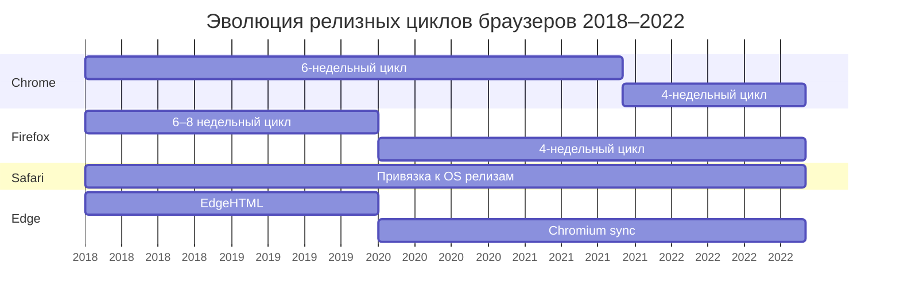

# Timeline релизов браузеров 2018–2022

## Обзор

В период с 2018 по 2022 годы произошли значительные изменения в релизных циклах основных браузеров:

- **Chrome** перешёл с 6-недельного цикла на 4-недельный (с Chrome 94, Q3 2021)
- **Firefox** ускорил цикл с 6 недель до 4 недель (с 2020 года)
- **Edge** полностью мигрировал на Chromium движок (январь 2020)
- **Safari** сохранил привязку релизов к версиям macOS/iOS

## Google Chrome / Chromium

### Особенности релизного цикла

- **2018–2021 Q2:** релизы каждые ~6 недель
- **2021 Q3–2022:** релизы каждые ~4 недели (начиная с Chrome 94)
- **Исключение:** Chrome 82 был пропущен из-за пандемии COVID-19

### 2018 (версии 64–71)

| Версия    | Дата релиза     | Примечания          |
| --------- | --------------- | ------------------- |
| Chrome 64 | 23 января 2018  |                     |
| Chrome 65 | 6 марта 2018    |                     |
| Chrome 66 | 17 апреля 2018  |                     |
| Chrome 67 | 29 мая 2018     |                     |
| Chrome 68 | 24 июля 2018    | HTTPS-only warnings |
| Chrome 69 | 4 сентября 2018 | 10-летие Chrome     |
| Chrome 70 | 17 октября 2018 |                     |
| Chrome 71 | 4 декабря 2018  |                     |

### 2019 (версии 72–79)

| Версия    | Дата релиза      | Примечания |
| --------- | ---------------- | ---------- |
| Chrome 72 | 29 января 2019   |            |
| Chrome 73 | 12 марта 2019    |            |
| Chrome 74 | 24 апреля 2019   |            |
| Chrome 75 | 4 июня 2019      |            |
| Chrome 76 | 30 июля 2019     |            |
| Chrome 77 | 10 сентября 2019 |            |
| Chrome 78 | 22 октября 2019  |            |
| Chrome 79 | 10 декабря 2019  |            |

### 2020 (версии 80–87)

| Версия    | Дата релиза     | Примечания                                |
| --------- | --------------- | ----------------------------------------- |
| Chrome 80 | 4 февраля 2020  | SameSite cookie changes                   |
| Chrome 81 | 7 апреля 2020   |                                           |
| Chrome 82 | **Пропущен**    | COVID-19 пандемия                         |
| Chrome 83 | 19 мая 2020     |                                           |
| Chrome 84 | 14 июля 2020    |                                           |
| Chrome 85 | 25 августа 2020 |                                           |
| Chrome 86 | 6 октября 2020  |                                           |
| Chrome 87 | 17 ноября 2020  | Значительные улучшения производительности |

### 2021 (версии 88–96)

| Версия    | Дата релиза      | Примечания                    |
| --------- | ---------------- | ----------------------------- |
| Chrome 88 | 19 января 2021   | Flash Player полностью удалён |
| Chrome 89 | 2 марта 2021     |                               |
| Chrome 90 | 13 апреля 2021   | HTTPS default для omnibox     |
| Chrome 91 | 25 мая 2021      |                               |
| Chrome 92 | 20 июля 2021     |                               |
| Chrome 93 | 31 августа 2021  |                               |
| Chrome 94 | 21 сентября 2021 | **Начало 4-недельного цикла** |
| Chrome 95 | 20 октября 2021  |                               |
| Chrome 96 | 16 ноября 2021   |                               |

### 2022 (версии 97–108)

| Версия     | Дата релиза      | Примечания       |
| ---------- | ---------------- | ---------------- |
| Chrome 97  | 4 января 2022    |                  |
| Chrome 98  | 1 февраля 2022   |                  |
| Chrome 99  | 1 марта 2022     |                  |
| Chrome 100 | 29 марта 2022    | Milestone версия |
| Chrome 101 | 26 апреля 2022   |                  |
| Chrome 102 | 24 мая 2022      |                  |
| Chrome 103 | 21 июня 2022     |                  |
| Chrome 104 | 2 августа 2022   |                  |
| Chrome 105 | 30 августа 2022  |                  |
| Chrome 106 | 27 сентября 2022 |                  |
| Chrome 107 | 25 октября 2022  |                  |
| Chrome 108 | 29 ноября 2022   |                  |

## Mozilla Firefox

### Особенности релизного цикла

- **2018–2019:** релизы каждые ~6–8 недель
- **2020–2022:** ускоренный цикл, релизы каждые ~4 недели
- **Extended Support Release (ESR):** специальные долгосрочные версии для enterprise

### 2018 (версии 58–64)

| Версия     | Дата релиза     | Примечания |
| ---------- | --------------- | ---------- |
| Firefox 58 | 23 января 2018  |            |
| Firefox 59 | 13 марта 2018   |            |
| Firefox 60 | 9 мая 2018      | ESR база   |
| Firefox 61 | 26 июня 2018    |            |
| Firefox 62 | 5 сентября 2018 |            |
| Firefox 63 | 23 октября 2018 |            |
| Firefox 64 | 11 декабря 2018 |            |

### 2019 (версии 65–71)

| Версия     | Дата релиза     | Примечания                                |
| ---------- | --------------- | ----------------------------------------- |
| Firefox 65 | 29 января 2019  |                                           |
| Firefox 66 | 19 марта 2019   |                                           |
| Firefox 67 | 21 мая 2019     |                                           |
| Firefox 68 | 9 июля 2019     | ESR база                                  |
| Firefox 69 | 3 сентября 2019 | Enhanced Tracking Protection по умолчанию |
| Firefox 70 | 22 октября 2019 |                                           |
| Firefox 71 | 3 декабря 2019  |                                           |

### 2020 (версии 72–84)

| Версия     | Дата релиза      | Примечания      |
| ---------- | ---------------- | --------------- |
| Firefox 72 | 7 января 2020    |                 |
| Firefox 73 | 11 февраля 2020  |                 |
| Firefox 74 | 10 марта 2020    |                 |
| Firefox 75 | 7 апреля 2020    |                 |
| Firefox 76 | 5 мая 2020       |                 |
| Firefox 77 | 2 июня 2020      |                 |
| Firefox 78 | 30 июня 2020     | ESR база        |
| Firefox 79 | 28 июля 2020     |                 |
| Firefox 80 | 25 августа 2020  |                 |
| Firefox 81 | 22 сентября 2020 |                 |
| Firefox 82 | 20 октября 2020  |                 |
| Firefox 83 | 17 ноября 2020   | HTTPS-Only Mode |
| Firefox 84 | 15 декабря 2020  |                 |

### 2021 (версии 85–95)

| Версия     | Дата релиза     | Примечания              |
| ---------- | --------------- | ----------------------- |
| Firefox 85 | 26 января 2021  | Supercookies защита     |
| Firefox 86 | 23 февраля 2021 | Total Cookie Protection |
| Firefox 87 | 23 марта 2021   | SmartBlock 2.0          |
| Firefox 88 | 19 апреля 2021  |                         |
| Firefox 89 | 1 июня 2021     | Proton UI redesign      |
| Firefox 90 | 13 июля 2021    |                         |
| Firefox 91 | 10 августа 2021 | ESR база                |
| Firefox 92 | 7 сентября 2021 |                         |
| Firefox 93 | 5 октября 2021  | AVIF image support      |
| Firefox 94 | 2 ноября 2021   |                         |
| Firefox 95 | 7 декабря 2021  |                         |

### 2022 (версии 96–107)

| Версия      | Дата релиза      | Примечания       |
| ----------- | ---------------- | ---------------- |
| Firefox 96  | 11 января 2022   |                  |
| Firefox 97  | 8 февраля 2022   |                  |
| Firefox 98  | 8 марта 2022     |                  |
| Firefox 99  | 5 апреля 2022    |                  |
| Firefox 100 | 3 мая 2022       | Milestone версия |
| Firefox 101 | 31 мая 2022      |                  |
| Firefox 102 | 28 июня 2022     | ESR база         |
| Firefox 103 | 26 июля 2022     |                  |
| Firefox 104 | 23 августа 2022  |                  |
| Firefox 105 | 20 сентября 2022 |                  |
| Firefox 106 | 18 октября 2022  |                  |
| Firefox 107 | 15 ноября 2022   |                  |

## Apple Safari / WebKit

### Особенности релизного цикла

- Мажорные релизы **привязаны к версиям macOS и iOS**
- Минорные обновления выходят между релизами ОС
- Safari Technology Preview — еженедельные preview builds для разработчиков

### 2018

| Версия        | Дата релиза      | ОС                      | Ключевые фичи                                      |
| ------------- | ---------------- | ----------------------- | -------------------------------------------------- |
| Safari 11.1   | 29 марта 2018    | macOS 10.13.4, iOS 11.3 | Service Workers, Payment Request API               |
| Safari 12.0   | 17 сентября 2018 | macOS Mojave            | Icons in tabs, ITP 2.0, Automatic Strong Passwords |
| Safari 12.0.1 | 30 октября 2018  | macOS Mojave            | Исправления                                        |
| Safari 12.0.2 | 5 декабря 2018   | macOS Mojave            | Исправления                                        |

### 2019

| Версия      | Дата релиза      | ОС                      | Ключевые фичи                                             |
| ----------- | ---------------- | ----------------------- | --------------------------------------------------------- |
| Safari 12.1 | 25 марта 2019    | macOS 10.14.4, iOS 12.2 | Dark Mode для веба, Intersection Observer, Web Share API  |
| Safari 13.0 | 20 сентября 2019 | macOS Catalina, iOS 13  | Sign in with Apple, Desktop-class browsing на iPad, FIDO2 |

### 2020

| Версия      | Дата релиза      | ОС                      | Ключевые фичи                                               |
| ----------- | ---------------- | ----------------------- | ----------------------------------------------------------- |
| Safari 13.1 | 24 марта 2020    | macOS 10.15.4, iOS 13.4 | Web Animations API, Async Clipboard API, Picture-in-Picture |
| Safari 14.0 | 16 сентября 2020 | macOS Big Sur, iOS 14   | WebP support, HTTP/3, WebExtensions API, Privacy Report     |

### 2021

| Версия      | Дата релиза      | ОС                     | Ключевые фичи                                       |
| ----------- | ---------------- | ---------------------- | --------------------------------------------------- |
| Safari 14.1 | 26 апреля 2021   | macOS 11.3, iOS 14.5   | `aspect-ratio`, `:is()`, Flexbox `gap`              |
| Safari 15.0 | 20 сентября 2021 | macOS Monterey, iOS 15 | Redesigned tabs, Tab Groups, `theme-color`, WebGL 2 |

### 2022

| Версия      | Дата релиза      | ОС                    | Ключевые фичи                                                          |
| ----------- | ---------------- | --------------------- | ---------------------------------------------------------------------- |
| Safari 15.4 | 14 марта 2022    | macOS 12.3, iOS 15.4  | `:has()`, `:focus-visible`, `<dialog>`, Cascade Layers, `accent-color` |
| Safari 16.0 | 12 сентября 2022 | macOS Ventura, iOS 16 | Container Queries, Subgrid, `:has()` improvements, Passkeys            |

**Важная деталь:** С Safari 11.1 WebKit версия в User-Agent была "заморожена" как `605.1.15` из соображений приватности.

## Microsoft Edge

### Особенности релизного цикла

- **До января 2020:** EdgeHTML движок (Edge Legacy)
- **С января 2020:** Chromium-based Edge (синхронизирован с релизами Chrome)
- После миграции на Chromium версии Edge следуют за версиями Chrome с минимальным лагом

### Timeline миграции на Chromium

| Дата            | Событие                                                   |
| --------------- | --------------------------------------------------------- |
| 6 декабря 2018  | Анонс миграции на Chromium (кодовое имя "Anaheim")        |
| 8 апреля 2019   | Запуск Canary и Dev каналов для Windows                   |
| 20 мая 2019     | Первые preview builds для macOS                           |
| 20 августа 2019 | Запуск Beta канала                                        |
| 15 января 2020  | **Официальный релиз Chromium Edge**                       |
| 3 июня 2020     | Начало автоматического развёртывания через Windows Update |

### 2018

| Версия      | Движок   | Примечания                     |
| ----------- | -------- | ------------------------------ |
| EdgeHTML 17 | EdgeHTML | Windows 10 April 2018 Update   |
| EdgeHTML 18 | EdgeHTML | Windows 10 October 2018 Update |

### 2019

| Версия                    | Движок   | Примечания                          |
| ------------------------- | -------- | ----------------------------------- |
| EdgeHTML 18 (продолжение) | EdgeHTML | Январь–декабрь 2019                 |
| Edge Canary/Dev/Beta      | Chromium | Preview релизы, апрель–декабрь 2019 |

### 2020 (версии 79+)

После перехода на Chromium Edge версии синхронизированы с Chrome:

| Версия  | Дата релиза     | Примечания                       |
| ------- | --------------- | -------------------------------- |
| Edge 79 | 15 января 2020  | Первый stable Chromium Edge      |
| Edge 80 | 7 февраля 2020  |                                  |
| Edge 81 | 13 апреля 2020  |                                  |
| Edge 83 | 19 мая 2020     | Версия 82 пропущена (как Chrome) |
| Edge 84 | 16 июля 2020    |                                  |
| Edge 85 | 27 августа 2020 |                                  |
| Edge 86 | 9 октября 2020  |                                  |
| Edge 87 | 19 ноября 2020  |                                  |

### 2021 (версии 88–96)

Edge продолжает следовать за Chrome с минимальным лагом (обычно 1–2 недели):

| Версия  | Примерная дата релиза |
| ------- | --------------------- |
| Edge 88 | Конец января 2021     |
| Edge 89 | Начало марта 2021     |
| Edge 90 | Середина апреля 2021  |
| Edge 91 | Конец мая 2021        |
| Edge 92 | Конец июля 2021       |
| Edge 93 | Начало сентября 2021  |
| Edge 94 | Конец сентября 2021   |
| Edge 95 | Конец октября 2021    |
| Edge 96 | Середина ноября 2021  |

### 2022 (версии 97–108)

Edge продолжает синхронизацию с Chrome на 4-недельном цикле:

| Версия   | Примерная дата релиза |
| -------- | --------------------- |
| Edge 97  | Начало января 2022    |
| Edge 98  | Начало февраля 2022   |
| Edge 99  | Начало марта 2022     |
| Edge 100 | Начало апреля 2022    |
| Edge 101 | Начало мая 2022       |
| Edge 102 | Конец мая 2022        |
| Edge 103 | Конец июня 2022       |
| Edge 104 | Начало августа 2022   |
| Edge 105 | Начало сентября 2022  |
| Edge 106 | Начало октября 2022   |
| Edge 107 | Конец октября 2022    |
| Edge 108 | Конец ноября 2022     |

## Сравнительная статистика

### Количество мажорных релизов за период 2018–2022

| Браузер | 2018               | 2019         | 2020         | 2021         | 2022         | Всего |
| ------- | ------------------ | ------------ | ------------ | ------------ | ------------ | ----- |
| Chrome  | 8 (64–71)          | 8 (72–79)    | 8 (80–87)    | 9 (88–96)    | 12 (97–108)  | 45    |
| Firefox | 7 (58–64)          | 7 (65–71)    | 13 (72–84)   | 11 (85–95)   | 12 (96–107)  | 50    |
| Safari  | 2 (11.1, 12)       | 2 (12.1, 13) | 2 (13.1, 14) | 2 (14.1, 15) | 2 (15.4, 16) | 10    |
| Edge    | 2 (EdgeHTML 17–18) | 0 (миграция) | 9 (79–87)    | 9 (88–96)    | 12 (97–108)  | 32\*  |

\* Chromium Edge

### Ускорение релизных циклов

## Выводы

### Ключевые тренды 2018–2022

1. **Ускорение циклов разработки:**
    - Chrome и Firefox перешли на 4-недельные релизы
    - Увеличение количества версий в год

2. **Консолидация на Chromium:**
    - Edge полностью мигрировал на Chromium (январь 2020)
    - Opera, Brave, Vivaldi также на Chromium
    - Около 70% рынка браузеров на одном движке к концу 2022

3. **Safari как сдерживающий фактор для baseline:**
    - Медленный релизный цикл (2 мажорных релиза в год)
    - Привязка к релизам iOS/macOS
    - Часто последний браузер, получающий поддержку новых фич

4. **COVID-19 влияние:**
    - Chrome 82 пропущен
    - Некоторые фичи отложены в 2020

### Методология определения baseline

**Baseline статус фичи достигается, когда:**

1. Фича **полностью реализована** во всех четырёх основных браузерах
2. Поддержка присутствует в **двух последних мажорных версиях** каждого браузера
3. Учитывая market share (по состоянию на 2022):
    - Chrome/Edge Chromium: ~65%
    - Safari: ~20%
    - Firefox: ~3–5%
    - Прочие (Opera, Brave и т.д.): ~10%

**Практическое правило для периода 2018–2022:**

Фича считается baseline, если она поддерживается:

- Chrome: начиная с версии N-2 от текущей
- Firefox: начиная с версии N-2 от текущей
- Safari: в последнем мажорном релизе
- Edge: синхронизирован с Chrome после января 2020

**Источники для проверки baseline статуса:**

- [Can I Use](https://caniuse.com) — browser support tables
- [MDN Browser Compatibility Data](https://github.com/mdn/browser-compat-data)
- [web.dev Baseline](https://web.dev/baseline) — официальная методология Google
- [WebKit Feature Status](https://webkit.org/status/)
- [Chrome Platform Status](https://chromestatus.com)
- [Firefox Platform Status](https://platform-status.mozilla.org)

**Источники:**

- Chrome Releases Blog: https://chromereleases.googleblog.com
- Firefox Release Notes: https://www.mozilla.org/firefox/releases/
- Safari Release Notes: https://developer.apple.com/documentation/safari-release-notes
- Wikipedia: Google Chrome version history, Firefox version history, Safari version history, Microsoft Edge
- Chromium Blog: Speeding up Chrome's release cycle (March 2021)

**Дата создания:** 17.11.2025
