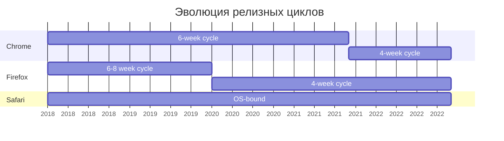

# Frontend Development: Comprehensive изменения 2018–2022

- **Research ID:** `frontend-baseline-2018-2022`
- **Дата:** 17.11.2025
- **Целевая аудитория:** Опытный frontend-разработчик (15+ лет опыта)
- **Период исследования:** 1 января 2018 — 31 декабря 2022

## Executive Summary

Период 2018–2022 стал одним из самых трансформационных в истории frontend-разработки. Ключевые
изменения:

### Институциональные сдвиги

- **Май 2019:** W3C передал управление HTML и DOM стандартами WHATWG — конец эры параллельных
  спецификаций
- **Январь 2020:** Microsoft Edge мигрировал на Chromium — консолидация ~70% рынка на одном движке
- **Март 2021:** Chrome и Firefox перешли на 4-недельные релизные циклы (с 6-недельных)

### Технологические прорывы

**HTML:**

- `<dialog>` достиг baseline (март 2022) — нативные модальные окна
- Native lazy loading через атрибут `loading` (baseline 2022)
- Контроль виртуальной клавиатуры: `enterkeyhint`, `inputmode`

**CSS:**

- Layout революция: Flexbox `gap` (2021), `aspect-ratio` (2021)
- Математика: `clamp()`, `min()`, `max()` (2020) — responsive без media queries
- Селекторы: `:is()`, `:where()` (2021), `:has()` появился (2022, baseline 2023)
- Accessibility: `prefers-color-scheme` (2020), `prefers-reduced-motion` (2020), `:focus-visible`
  (2022)

**JavaScript:**

- ES2020 — самый значимый релиз: optional chaining (`?.`), nullish coalescing (`??`),
  `Promise.allSettled()`, BigInt
- ES2022: top-level await, private class fields, `Array.at()`
- Web APIs: Observers расширение (Resize, Intersection v2), Performance APIs (Core Web Vitals)

### Статистика изменений

```
Браузерные релизы 2018–2022:
├── Chrome:   45 релизов (64 → 108)
├── Firefox:  50 релизов (58 → 107)
├── Safari:   10 релизов (11.1 → 16)
└── Edge:     32 релиза Chromium-based (79 → 108)

Ключевые baseline достижения:
├── HTML:   ~8 значимых фич достигли baseline
├── CSS:    ~20 значимых фич достигли baseline
└── JS/API: ~30 значимых фич достигли baseline
```

## Структура исследования

Детальные материалы организованы по модулям:

### 📁 Основные документы

1. **[html-changes.md](html.md)** — детальный обзор HTML изменений с примерами
2. **[css-changes.md](css.md)** — comprehensive CSS изменения
3. **[javascript-webapis-summary.md](javascript.md)** — ключевые JavaScript и Web API изменения
4. **[final-report.md](./index.md)** — этот документ (executive summary и roadmap)
5. **[scope.md](../scope.md)** — границы исследования, критерии, методология
6. **[browser-timeline.md](../browser-timeline.md)** — timeline релизов браузеров, baseline
   методология

## Timeline ключевых событий

### 2018

**Q1:**

- **Январь:** Chrome 64, AppCache депрекация в DevTools warnings
- **Март:** Firefox 59 (overscroll-behavior), Safari 11.1 (Service Workers)

**Q2-Q4:**

- **Июль:** Chrome 68 (HTTPS-only warnings)
- **Сентябрь:** Safari 12 (ITP 2.0, Automatic Strong Passwords)
- **Октябрь:** Chrome 70 (AppCache удаление из insecure origins), Firefox 63 (Flexbox gap)

**Язык:**

- ES2018: async iteration, rest/spread для объектов, `Promise.finally()`

### 2019 — год консолидации

**Q1-Q2:**

- **Март:** Safari 12.1 (Dark Mode для веба, Intersection Observer)
- **Апрель:** Chrome 74 (native lazy loading за флагом)
- **Май:** W3C передаёт HTML/DOM управление WHATWG ⭐

**Q3-Q4:**

- **Июль:** Chrome 76 (`loading="lazy"` stable, `backdrop-filter`)
- **Сентябрь:** Safari 13 (Sign in with Apple, FIDO2)
- **Декабрь:** Firefox 71 (subgrid — первый браузер!)

**Язык:**

- ES2019: `Array.flat()`, `flatMap()`, `Object.fromEntries()`, `String.trim*()`

### 2020 — COVID и прорывы

**Q1:**

- **Январь:** Edge Chromium релиз ⭐
- **Март:** Safari 13.1 (Web Animations API, Async Clipboard, PiP)
- **Апрель:** Firefox 75 (`loading="lazy"`), Chrome 81

**Q2-Q4:**

- **Июль:** Chrome 84 (Flexbox gap, AppCache disabled by default), `clamp()` baseline ⭐
- **Август:** Chrome 85 (`@property` — Houdini)
- **Сентябрь:** Safari 14 (`:is()`, `:where()`)
- **Ноябрь:** Chrome 87 (значительные performance улучшения)
- **Декабрь:** WHATWG удаляет AppCache из спецификации, Adobe Flash Player EOL

**Язык:**

- ES2020 — прорыв: optional chaining (`?.`), nullish coalescing (`??`), BigInt,
  `Promise.allSettled()`, dynamic `import()` ⭐

### 2021 — year of baseline

**Q1-Q2:**

- **Январь:** Chrome 88 (Flash полностью удалён)
- **Апрель:** Safari 14.1 (Flexbox gap baseline ⭐, `aspect-ratio`)
- **Май:** Chrome 90 (Declarative Shadow DOM)
- **Июнь:** Firefox 89 (Proton UI redesign), HTML 5.x retired в пользу Living Standard

**Q3-Q4:**

- **Сентябрь:** Safari 15 (`aspect-ratio` baseline ⭐), Chrome 94 (4-week release cycle начало)
- **Ноябрь:** Firefox 94 (`enterkeyhint` baseline)
- **Декабрь:** Firefox 95 (`inputmode` baseline)

**Язык:**

- ES2021: logical assignment (`||=`, `&&=`, `??=`), numeric separators, `String.replaceAll()`,
  `Promise.any()`

### 2022 — финальные штрихи периода

**Q1-Q2:**

- **Март:** Safari 15.4 — множественный baseline ⭐:
    - `<dialog>` (наконец!)
    - `:has()` (первый браузер)
    - `:focus-visible`
    - `loading="lazy"`
    - Cascade Layers
    - `accent-color`

- **Апрель:** Chrome 101 (`fetchpriority`)
- **Май:** Chrome 102, Safari 15.5 (`inert`)

**Q3-Q4:**

- **Август:** Chrome 105 (`:has()`, Container Queries), Firefox 104
- **Сентябрь:** Safari 16 (Container Queries, subgrid), `overscroll-behavior` baseline
- **Ноябрь:** Chrome 108

**Язык:**

- ES2022: top-level await, `Array.at()`, `Object.hasOwn()`, private class fields, `Error.cause`

## Ключевые тренды и insights

### 1. Консолидация экосистемы

**Chromium доминирование:**

- Edge миграция (январь 2020) → ~70% market share на Chromium
- Opera, Brave, Vivaldi — все на Chromium
- Только Firefox (Gecko) и Safari (WebKit) остаются независимыми

**Последствия:**

- ✅ Быстрее достигается baseline для фич, поддерживаемых Chromium
- ✅ Меньше cross-browser багов
- ⚠️ Риск монокультуры, меньше конкуренции идей
- ⚠️ Safari становится "новым IE" — часто последний получает поддержку

### 2. Safari как сдерживающий фактор

Множество фич достигло baseline только после поддержки Safari:

| Фича             | Chrome | Firefox | Safari (последний) | Baseline |
| ---------------- | ------ | ------- | ------------------ | -------- |
| Flexbox gap      | 2020   | 2018    | **2021**           | 2021     |
| `aspect-ratio`   | 2021   | 2021    | **2021**           | 2021     |
| `<dialog>`       | 2014   | 2022    | **2022**           | 2022     |
| `:focus-visible` | 2020   | 2021    | **2022**           | 2022     |
| `loading="lazy"` | 2019   | 2020    | **2022**           | 2022     |

**Причина:** Safari релизы привязаны к macOS/iOS релизам (2 раза в год vs. 8-12 раз для
Chrome/Firefox).

### 3. Ускорение релизных циклов



**Последствия:**

- Более быстрое внедрение фич
- Больше версий для тестирования
- Сложнее поддержка старых версий

### 4. Layout достиг зрелости

**CSS Grid (baseline 2017)** + **Flexbox gap (2021)** + **aspect-ratio (2021)** = полный набор
инструментов для современного layout без хаков.

**До:**

```css
/* Padding-bottom hack для aspect ratio */
.video-wrapper {
    position: relative;
    padding-bottom: 56.25%; /* 16:9 */
    height: 0;
}

/* Margin хаки для gap */
.flex-item {
    margin-right: 1rem;
}
.flex-item:last-child {
    margin-right: 0;
}
```

**После:**

```css
.video {
    aspect-ratio: 16 / 9;
}

.flex-container {
    display: flex;
    gap: 1rem;
}
```

### 5. Функциональное программирование в CSS

`clamp()`, `min()`, `max()` (baseline 2020) изменили подход к responsive design:

**Старый подход:**

```css
.title {
    font-size: 1.5rem;
}

@media (min-width: 768px) {
    .title {
        font-size: 2rem;
    }
}

@media (min-width: 1200px) {
    .title {
        font-size: 3rem;
    }
}
```

**Новый подход:**

```css
.title {
    font-size: clamp(1.5rem, 5vw, 3rem);
    /* Responsive без media queries! */
}
```

### 6. JavaScript: от sugar syntax к реальным улучшениям

**ES2020 — переломный момент:**

До ES2020 многие фичи были syntax sugar (arrow functions, destructuring и т.д.).

ES2020 принёс реальные новые возможности:

- Optional chaining — решает null/undefined traversal
- Nullish coalescing — решает falsy values проблему
- BigInt — arbitrary precision numbers
- `Promise.allSettled()` — новые async паттерны

**Практическое влияние:**

```javascript
// До ES2020 — verbose и error-prone
let street;
if (user && user.address && user.address.street) {
    street = user.address.street;
} else {
    street = 'Unknown';
}

// ES2020 — concise и безопасно
const street = user?.address?.street ?? 'Unknown';
```

### 7. Performance становится first-class concern

**Core Web Vitals (2020)** + **Performance APIs** = измеримый UX.

```javascript
// Layout Shift tracking
let cls = 0;
new PerformanceObserver((list) => {
    for (const entry of list.getEntries()) {
        if (!entry.hadRecentInput) {
            cls += entry.value;
        }
    }
}).observe({ type: 'layout-shift', buffered: true });

// LCP tracking
new PerformanceObserver((list) => {
    const entries = list.getEntries();
    const lastEntry = entries[entries.length - 1];
    console.log('LCP:', lastEntry.renderTime);
}).observe({ type: 'largest-contentful-paint', buffered: true });
```

### 8. Accessibility из "nice to have" в "must have"

- `prefers-color-scheme` (2020) — respect user preference
- `prefers-reduced-motion` (2020) — respect accessibility needs
- `:focus-visible` (2022) — умный фокус без UX компромиссов
- `enterkeyhint` (2021) — лучший mobile UX
- Native `<dialog>` (2022) — accessibility из коробки

### 9. Фичи, которые "почти" достигли baseline

Появились в 2022, но не достигли baseline в исследуемый период:

- **`:has()`** — революционный селектор (baseline 2023)
- **Container Queries** — новая парадигма responsive design (baseline 2023)
- **Subgrid** — долгожданное завершение Grid (baseline 2023)
- **`@property`** — typed custom properties (baseline 2024)

## Практические рекомендации

### Что использовать сегодня (100% safe)

#### HTML

```html
<!-- Нативные модальные окна -->
<dialog id="modal">
    <form method="dialog">
        <button>Закрыть</button>
    </form>
</dialog>

<!-- Lazy loading -->

<iframe src="video.html" loading="lazy"></iframe>

<!-- Улучшенный UX форм -->
<input type="text" inputmode="decimal" enterkeyhint="next" />
```

#### CSS

```css
/* Layout без хаков */
.container {
    display: flex;
    gap: 1rem;
}

.item {
    aspect-ratio: 16 / 9;
}

/* Responsive typography */
h1 {
    font-size: clamp(2rem, 5vw, 4rem);
}

/* Современные селекторы */
:is(h1, h2, h3):is(.title, .heading) {
    font-family: sans-serif;
}

/* Accessibility */
@media (prefers-color-scheme: dark) {
    :root {
        --bg: #1a1a1a;
        --text: #f0f0f0;
    }
}

@media (prefers-reduced-motion: reduce) {
    * {
        animation-duration: 0.01ms !important;
    }
}

/* Умный фокус */
:focus-visible {
    outline: 2px solid blue;
}

/* Logical properties для i18n */
.element {
    margin-inline: 1rem;
    padding-block: 2rem;
}
```

#### JavaScript

```javascript
// Modern syntax (ES2020-2022)
const value = data?.deeply?.nested?.property ?? 'default';

// Отменяемые операции
const controller = new AbortController();
fetch('/api', { signal: controller.signal });
element.addEventListener('click', handler, { signal: controller.signal });

// Observers для производительности
const observer = new IntersectionObserver((entries) => {
    entries.forEach((entry) => {
        if (entry.isIntersecting) {
            lazyLoad(entry.target);
        }
    });
});

// Performance tracking
new PerformanceObserver((list) => {
    for (const entry of list.getEntries()) {
        analytics.track(entry.name, entry.value);
    }
}).observe({ entryTypes: ['paint', 'lcp', 'layout-shift'] });
```

### Progressive Enhancement стратегия

Для фич, которые появились в конце периода:

```css
/* Базовый layout */
.grid {
    display: grid;
    grid-template-columns: repeat(auto-fit, minmax(250px, 1fr));
}

/* Улучшение для subgrid (если доступен) */
@supports (grid-template-columns: subgrid) {
    .grid-item {
        display: grid;
        grid-template-columns: subgrid;
    }
}

/* Улучшение для :has() (если доступен) */
@supports selector(:has(*)) {
    .card:has(img) {
        grid-template-columns: 200px 1fr;
    }
}

/* Улучшение для Container Queries (если доступны) */
@supports (container-type: inline-size) {
    .container {
        container-type: inline-size;
    }

    @container (min-width: 400px) {
        .card {
            flex-direction: row;
        }
    }
}
```

### Чего избегать

**Deprecated/Removed:**

```javascript
// ❌ AppCache — удалён
<html manifest="app.appcache">

// ❌ Flash Player — удалён (январь 2021)
<embed src="movie.swf" type="application/x-shockwave-flash">

// ❌ Синхронный XHR — deprecated
const xhr = new XMLHttpRequest();
xhr.open('GET', '/api', false); // ⚠️
xhr.send();

// ✅ Используйте fetch
const data = await fetch('/api').then(r => r.json());
```

**Анти-паттерны:**

```css
/* ❌ Убирать outline без :focus-visible */
button:focus {
    outline: none; /* Ломает accessibility */
}

/* ✅ Правильно */
button:focus:not(:focus-visible) {
    outline: none;
}
button:focus-visible {
    outline: 2px solid blue;
}
```

## Roadmap для изучения

### Фаза 1: Фундаментальные изменения (1-2 недели)

**Приоритет 1 — Must know:**

1. **HTML `<dialog>`** → Прочитать [html-changes.md](html.md), секция `<dialog>`
    - Практика: создать модальное окно без библиотек
    - Изучить accessibility автоматику

2. **CSS Layout набор** → [css-changes.md](css.md), секции Layout
    - Flexbox `gap`
    - `aspect-ratio`
    - Потренировать responsive cards без хаков

3. **CSS функции** → [css-changes.md](css.md), секция Functions
    - `clamp()`, `min()`, `max()`
    - Практика: responsive typography без media queries

4. **JavaScript ES2020** → [javascript-webapis-summary.md](javascript.md), секция ES2020
    - Optional chaining (`?.`)
    - Nullish coalescing (`??`)
    - Рефакторинг существующего кода с этими фичами

### Фаза 2: Селекторы и улучшение workflow (1 неделя)

**Приоритет 2 — Should know:**

1. **CSS селекторы** → [css-changes.md](css.md)
    - `:is()`, `:where()`
    - `:focus-visible`
    - Практика: упрощение сложных селекторов

2. **Logical properties** → [css-changes.md](css.md)
    - Изучить mapping (физические → логические)
    - Потренировать на RTL layout

3. **JavaScript ES2021-2022** → [javascript-webapis-summary.md](javascript.md)
    - `Array.at()`, `Object.hasOwn()`
    - Top-level await
    - Private class fields

### Фаза 3: Performance и accessibility (1 неделя)

**Приоритет 3 — Important:**

1. **Lazy loading** → [html-changes.md](html.md)
    - `loading="lazy"` для images и iframes
    - Feature detection и fallbacks

2. **Performance APIs** → [javascript-webapis-summary.md](javascript.md)
    - Core Web Vitals tracking
    - Intersection Observer, Resize Observer
    - Практика: добавить performance monitoring

3. **Accessibility media queries** → [css-changes.md](css.md)
    - `prefers-color-scheme` — Dark mode
    - `prefers-reduced-motion`
    - Практика: respect user preferences

### Фаза 4: Продвинутые темы (ongoing)

**Приоритет 4 — Nice to have:**

1. **Container Queries** (появились 2022, baseline 2023)
    - Изучить концепцию
    - Progressive enhancement подход

2. **`:has()`** (появился 2022, baseline 2023)
    - Новые паттерны дизайна
    - Feature detection

3. **`@property`** (Chrome 2020, baseline 2024)
    - Typed custom properties
    - Houdini APIs

### Практические проекты для закрепления

**Проект 1: Modern Landing Page**

- Использовать: `aspect-ratio`, `clamp()`, Flexbox `gap`, `<dialog>`
- Dark mode через `prefers-color-scheme`
- Lazy loading изображений
- Performance tracking (Core Web Vitals)

**Проект 2: Accessible Form Component**

- Native `<dialog>` для modals
- `enterkeyhint`, `inputmode` для mobile UX
- `:focus-visible` для keyboard navigation
- `inert` для модального состояния (если доступен)

**Проект 3: Responsive Card Grid**

- CSS Grid с `gap`
- `aspect-ratio` для media
- `:is()`, `:where()` для селекторов
- Container Queries (progressive enhancement)

## Источники и дополнительные материалы

### Первичные источники

**Спецификации:**

- WHATWG HTML Living Standard: https://html.spec.whatwg.org
- W3C CSS Working Group: https://www.w3.org/Style/CSS/
- TC39 ECMAScript Proposals: https://github.com/tc39/proposals

**Browser Release Notes:**

- Chrome: https://chromereleases.googleblog.com, https://chromestatus.com
- Firefox: https://www.mozilla.org/firefox/releases/, https://developer.mozilla.org/Firefox
- Safari: https://developer.apple.com/documentation/safari-release-notes, https://webkit.org/blog/
- Edge: https://learn.microsoft.com/deployedge/microsoft-edge-release-schedule

**Compatibility данные:**

- MDN Browser Compatibility Data: https://github.com/mdn/browser-compat-data
- Can I Use: https://caniuse.com
- web.dev Baseline: https://web.dev/baseline

### Обучающие ресурсы

**Официальные:**

- MDN Web Docs: https://developer.mozilla.org
- web.dev: https://web.dev (Google)
- WebKit Blog: https://webkit.org/blog/

**Community:**

- CSS-Tricks: https://css-tricks.com
- Smashing Magazine: https://www.smashingmagazine.com
- JavaScript Weekly: https://javascriptweekly.com
- Frontend Focus: https://frontendfocus.co

### Recommended Reading Order

1. **Этот файл** (`final-report.md`) — executive summary и roadmap
2. **[html-changes.md](html.md)** — детально HTML (70+ KB)
3. **[css-changes.md](css.md)** — детально CSS (50+ KB)
4. **[javascript-webapis-summary.md](javascript.md)** — ключевые JS/API изменения
5. **[scope.md](../scope.md)** — понять границы исследования
6. **[browser-timeline.md](../browser-timeline.md)** — контекст релизов

## Заключение

### Главные выводы

Период 2018–2022 завершил трансформацию, начатую в 2010-х:

1. **HTML** достиг функциональной полноты — всё для современного веба без библиотек
2. **CSS** получил все инструменты для любого layout — Grid, Flexbox, математика, Container Queries
   (конец периода)
3. **JavaScript** стал зрелым языком — optional chaining, BigInt, top-level await решают реальные
   проблемы

**Ключевое изменение mindset:**

- **2010-2015:** "Нужна библиотека для этого?"
- **2016-2018:** "Может быть есть нативное решение?"
- **2019-2022:** "Скорее всего есть нативное решение, проверю baseline"

### Что дальше (2023+)

Фичи, которые появились в конце периода и станут mainstream после 2022:

- **Container Queries** — смена парадигмы в responsive design
- **`:has()`** — CSS получает "родительские" селекторы
- **Subgrid** — завершение CSS Grid
- **Cascade Layers** — новый уровень контроля над каскадом
- **View Transitions API** — плавные переходы между страницами

**Для следующего исследования (2023+):**

- Продолжение Container Queries adoption
- View Transitions API
- Popover API
- Anchor Positioning
- CSS Nesting native support
- И многое другое...

**Последнее обновление:** 17.11.2025 **Исследователь:** DeepResearch Agent **Методология:** Living
Standard tracking, browser release notes analysis, MDN/Can I Use cross-reference
